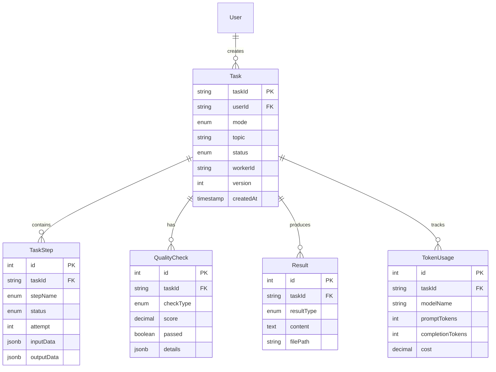

# 实施分析 - 关键上下文

**项目**: Content Creator (写作 Agent)
**分析日期**: 2025-01-18
**文档版本**: 1.0

---

## 📁 关键文件

### 架构设计文档
- **路径**: `docs/architecture-complete.md`
- **大小**: 5524 行
- **内容**: 完整的系统架构设计
  - 16 个主要章节
  - 5 个核心领域模型
  - 完整的数据库表结构
  - 详细的工作流设计

### 实施计划
- **路径**: `docs/implementation-plan.md`
- **大小**: 1508 行
- **内容**: 渐进式实施计划
  - 4 个开发阶段
  - 每个阶段的详细任务
  - 代码示例和验收标准

### 阶段 0 指南
- **路径**: `docs/phase-0-setup-guide.md`
- **大小**: 700+ 行
- **内容**: 环境准备详细步骤

### 环境配置
- **路径**: `.env`
- **内容**:
  - PostgreSQL 连接（本地 Docker）
  - Redis 连接（150.158.88.23）
  - DeepSeek API Key
  - Tavily API Key (MCP Search)
  - Doubao API Key

---

## 🎯 核心设计决策

### 1. 架构模式：分布式多 Worker

**选择理由**:
- ✅ 支持 100 用户并发
- ✅ 20 个任务同时执行
- ✅ Worker 故障自动恢复
- ✅ 可水平扩展

**技术栈**:
```
PostgreSQL 14+ (必需，不用 SQLite)
├── 理由: MVCC 并发、ACID 保证、分布式支持
Bull + Redis 7+
├── 理由: 成熟稳定、功能丰富、支持重试
Node.js Workers (5 × 2 并发 = 10 任务)
├── 理由: 单线程适合 I/O 密集型任务
```

### 2. 数据库：PostgreSQL vs SQLite

| 特性 | SQLite | PostgreSQL |
|------|--------|------------|
| 并发写入 | ❌ 写锁 | ✅ MVCC |
| 连接数 | ❌ 单连接 | ✅ 100+ |
| 分布式 | ❌ 不支持 | ✅ 支持 |
| 生产级 | ❌ 不推荐 | ✅ 是 |

**决策**: PostgreSQL

### 3. 工作流引擎：LangGraph

**选择理由**:
- ✅ 状态管理优秀
- ✅ 可视化调试
- ✅ 支持循环和条件路由
- ✅ 断点续传（Checkpoint）

**核心概念**:
```typescript
State: 工作流状态（不可变）
Node: 处理节点（Search, Write, Check...）
Graph: 有向图（节点 + 边）
Edge: 条件路由（if/else）
```

### 4. 质量检查：双层架构

**第一层：硬规则检查**
- 字数检查（minWords, maxWords）
- 关键词检查（keywords）
- 结构检查（标题、正文、结尾）

**第二层：LLM 评审**
- 相关性（relevance）
- 连贯性（coherence）
- 完整性（completeness）
- 可读性（readability）

**评分机制**:
```
硬规则不通过 → 0 分，立即重试
硬规则通过 → LLM 评分（1-10 分）
≥ 7 分 → 通过
< 7 分 → 不通过，返回建议重试
最多重试 3 次
```

### 5. 存储策略

**文案（文本）**:
- 主存储：PostgreSQL（JSONB）
- 备份：S3（可选）
- 导出：本地文件（可选）

**图片（二进制）**:
- 开发：本地文件系统（`./data/images`）
- 生产：S3/OSS/MinIO
- 数据库：仅存储 URL/路径

**理由**:
- 文案需要检索和版本管理 → 数据库
- 图片不需要检索 → 对象存储
- 降低数据库存储压力

---

## 📊 领域模型关系



---

## 🔄 核心工作流

### 同步执行流程

```
用户请求
  ↓
创建任务（状态: pending）
  ↓
Sync Executor.execute()
  ↓
LangGraph Workflow.invoke()
  ↓
┌─────────────────────────────┐
│ Search Node                 │
│ ─────────────────────────── │
│ • 调用 MCP Search           │
│ • 收集资料                  │
└─────────────────────────────┘
  ↓
┌─────────────────────────────┐
│ Organize Node               │
│ ─────────────────────────── │
│ • 整理资料                  │
│ • 生成大纲                  │
└─────────────────────────────┘
  ↓
┌─────────────────────────────┐
│ Write Node                  │
│ ─────────────────────────── │
│ • LLM 生成文章              │
│ • 保存 content              │
└─────────────────────────────┘
  ↓
┌─────────────────────────────┐
│ Check Text Node             │
│ ─────────────────────────── │
│ • 硬规则检查                │
│ • LLM 评审                  │
│ • 评分                      │
└─────────────────────────────┘
  ↓
  ├─≥ 7 分 → 继续
  └─< 7 分 → 回到 Write（最多 3 次）
      ↓
┌─────────────────────────────┐
│ Generate Image Node         │
│ ─────────────────────────── │
│ • 生成配图                  │
│ • 保存 URL                  │
└─────────────────────────────┘
  ↓
┌─────────────────────────────┐
│ Check Image Node            │
│ ─────────────────────────── │
│ • 相关性评分                │
│ • 美学评分                  │
└─────────────────────────────┘
  ↓
  ├─通过 → 保存结果
  └─失败 → 回到 GenImage（最多 3 次）
  ↓
更新任务状态（completed）
  ↓
返回结果给用户
```

### 异步执行流程（多 Worker）

```
用户请求
  ↓
创建任务（状态: pending）
  ↓
Async Executor.submit()
  ↓
添加到 Bull Queue
  ↓
返回 taskId 给用户
  ↓
用户可以查询状态（轮询或 WebSocket）
  ↓
─────────────────────────────────
  ↓
Worker 1          Worker 2          Worker 3
  │                 │                 │
  ├─ claimTask()    ├─ claimTask()    ├─ claimTask()
  │                 │                 │
  ├─ 执行工作流      ├─ 执行工作流      ├─ 执行工作流
  │                 │                 │
  └─ 保存结果        └─ 保存结果        └─ 保存结果
  ↓                 ↓                 ↓
```

---

## 🔐 安全设计

### 1. API Key 管理

**加密存储**:
```typescript
// 加密
const encrypted = crypto.encrypt('sk-xxx', key);
// 存储
await db.query('INSERT INTO api_keys (key) VALUES ($1)', [encrypted]);

// 解密（运行时）
const decrypted = crypto.decrypt(encrypted, key);
```

**使用 AWS KMS**（推荐）:
```bash
# 加密 API Key
aws kms encrypt --key-id xxx --plaintext file://api_key.txt --output ciphertext.blob

# 存储加密后的 Base64
export DEEPSEEK_API_KEY_ENCRYPTED="AQICAHh..."

# 运行时解密
const decrypted = await kms.decrypt(ciphertext);
```

### 2. 内容审核

**集成阿里云内容安全**:
```typescript
// 文本审核
const result = await aliyun.green.textScan(content);
if (result.riskLevel === 'high') {
  throw new Error('Content rejected');
}

// 图片审核
const result = await aliyun.green.imageScan(imageUrl);
if (result.riskLevel === 'high') {
  throw new Error('Image rejected');
}
```

### 3. Token 监控

**预算控制**:
```typescript
class TokenMonitor {
  private dailyLimit = 10_000_000; // 1000 万 tokens/天

  record(usage: number) {
    this.dailyUsage += usage;

    // 80% 告警
    if (this.dailyUsage >= this.dailyLimit * 0.8) {
      this.sendAlert('Token usage at 80%');
    }

    // 100% 拒绝
    if (this.dailyUsage >= this.dailyLimit) {
      throw new Error('Token budget exceeded');
    }
  }
}
```

---

## 📈 容量规划

### 配置：5 Worker × 2 并发 = 10 并发任务

**吞吐量计算**:
```
单任务平均时间: 3 分钟
单 Worker 吞吐量: 60/3 × 2 = 40 任务/小时
5 Worker 吞吐量: 40 × 5 = 200 任务/小时
日吞吐量: 200 × 24 = 4800 任务/天（理论值）
实际吞吐量: 3000 任务/天（考虑效率系数）
```

**并发用户支持**:
```
假设 20% 用户同时提交任务
100 用户 × 20% = 20 个并发任务需求
10 个并发任务处理能力
余量系数: 5.76 ÷ 2 = 2.88 倍
```

### 成本估算（月度）

| 项目 | 计算 | 成本 |
|------|------|------|
| **DeepSeek API** | 3000 任务 × 3000 tokens × 30 天 × ¥1/100 万 | ¥270 |
| **Doubao API** | 3000 任务 × ¥0.02 × 30 天 | ¥180 |
| **内容审核** | 3000 × 2 × ¥0.001 × 30 天 | ¥7 |
| **PostgreSQL** | 云数据库 4 核 8GB | ¥100-200 |
| **Redis** | 云缓存 2 核 4GB | ¥50-100 |
| **S3 存储** | 100GB | ¥10-20 |
| **总计** | - | **¥550-900** |

---

## 🚨 已识别风险

### 技术风险

1. **LangGraph 学习曲线**
   - 影响: 开发进度延迟
   - 缓解: 预留学习时间，准备备选方案（直接使用 LangChain）

2. **并发控制复杂**
   - 影响: 任务重复执行或丢失
   - 缓解: 乐观锁 + 充分测试

3. **LLM API 不稳定**
   - 影响: 任务失败率升高
   - 缓解: 重试机制 + 熔断器

### 业务风险

1. **内容合规**
   - 影响: 法律风险
   - 缓解: 强制内容审核

2. **成本失控**
   - 影响: 运营成本激增
   - 缓解: Token 监控 + 预算告警

---

## 🔗 外部依赖

### 必需服务

| 服务 | 用途 | 重要性 | 备选方案 |
|------|------|--------|----------|
| **PostgreSQL** | 数据持久化 | 🔴 P0 | - |
| **Redis** | 缓存和队列 | 🔴 P0 | - |
| **DeepSeek API** | LLM | 🔴 P0 | OpenAI, Claude |
| **Doubao API** | 图片生成 | 🟡 P1 | Midjourney, DALL-E |
| **MCP Search** | 搜索 | 🟡 P1 | Google Search API |

### 可选服务

| 服务 | 用途 | 重要性 |
|------|------|--------|
| **Sentry** | 错误追踪 | 🟢 P2 |
| **Prometheus** | 指标监控 | 🟢 P2 |
| **阿里云内容安全** | 内容审核 | 🟡 P1 |

---

## 📋 待决问题

1. **是否需要用户管理系统？**
   - 当前设计：无用户管理（单用户模式）
   - 需求待确认：是否需要多租户？

2. **是否需要 Web 界面？**
   - 当前设计：仅 CLI
   - 需求待确认：是否需要 REST API + Web UI？

3. **内容审核是否强制？**
   - 当前设计：可选
   - 需求待确认：是否所有内容必须过审？

4. **是否需要版本控制？**
   - 当前设计：仅保存最新结果
   - 需求待确认：是否需要保留历史版本？

---

## 📖 参考资料

### 技术文档
- [LangGraph 官方文档](https://langchain-ai.github.io/langgraph/)
- [Bull 队列文档](https://docs.bullmq.io/)
- [PostgreSQL 14 文档](https://www.postgresql.org/docs/14/)

### 设计模式
- 领域驱动设计 (DDD)
- 工作流模式 (Workflow Pattern)
- CQRS (命令查询职责分离)

### 类似项目
- AutoGPT
- AgentGPT
- LangChain Agents

---

**最后更新**: 2025-01-18
**维护者**: 开发团队
**下次评审**: 阶段 1 启动前
