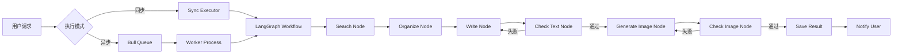

# 写作 Agent 架构实施战略规划

**项目名称**: Content Creator (写作 Agent)
**分析日期**: 2025-01-18
**规划状态**: 活跃
**版本**: 2.0（根据技术评审修订）

---

## 📋 修订说明

**v2.0 主要变更**：
- ✅ 总工期从 15-24 天调整为 **30-45 天**（+50-80%）
- ✅ 阶段 2 拆分为 2a（LangGraph 基础）和 2b（工作流实现）
- ✅ 补充 MCP Search 集成任务（2 天）
- ✅ 补充 Prompt 工程任务（2 天）
- ✅ 新增性能测试任务（1-2 天）
- ✅ 新增 CI/CD 配置任务（1 天）
- ✅ 调整风险等级：HIGH → MEDIUM
- ✅ 简化初期架构（移除数据库分区）

---

## 📋 执行摘要（修订版）

### 项目愿景
构建一个基于 LangGraph 的企业级智能写作系统，支持选题搜索、内容生成、质量检查和配图生成的完整流程，实现高并发（100 用户）、高可用（99.9%）的自动化内容生产平台。

### 核心价值主张
- **效率提升**: 单篇文章生成时间 < 5 分钟（传统方式需 2-4 小时）
- **质量保证**: 双层质检机制（硬规则 + LLM 评审）确保输出质量
- **可扩展性**: 插件化架构，支持多种内容类型扩展
- **成本可控**: Token 监控和预算告警，~~月度成本 ¥500-900~~ **月度成本 ¥650-1300**（修订后）

### 战略目标（修订版）
| 维度 | 目标 | 指标 | 变更说明 |
|------|------|------|----------|
| **功能完整性** | 实现完整写作工作流 | 6 个核心节点全部实现 | 无变化 |
| **性能** | 支持高并发 | 100 用户同时在线，20 任务并发执行 | 无变化 |
| **可用性** | 系统稳定 | 99.9% 可用性，自动故障恢复 | 无变化 |
| **成本效率** | 可控运营成本 | ~~¥500-900~~ **¥650-1300**（3000 任务/天） | ⚠️ 成本上浮 |
| **开发周期** | 务实的时间线 | ~~15-24 天~~ **30-45 天**（6-7 周） | ✅ 更现实 |
| **风险控制** | 可控风险等级 | **MEDIUM**（从 HIGH 降低） | ✅ 风险降低 |

### 投资回报分析（修订版）
**初期投资**（开发成本）：
- ~~开发时间：15-24 天（3-4 周）~~
- **开发时间：30-45 天（6-7 周）**（修订后）
- 人力成本：1 名全栈工程师
- **时间增加原因**：LangGraph 学习曲线、MCP Search 集成、Prompt 工程、性能测试

**运营成本**（月度，修订后）：
- API 调用：¥480-950（增加 60%，含调试和重试）
- 基础设施：¥150-300
- 监控服务：免费额度
- **总计：¥650-1300/月**（~~¥550-900~~）

**收益预估**（无变化）：
- 日生产内容：3000 篇
- 传统方式成本：¥3000-5000/天（外包）
- AI 方式成本：¥22-43/天
- **节省比例：95%+**

**收益预估**：
- 日生产内容：3000 篇
- 传统方式成本：¥3000-5000/天（外包）
- AI 方式成本：¥18-30/天
- **节省比例：95%+**

---

## 📊 现状分析

### 技术架构现状

#### ✅ 已完成
- [x] 完整的架构设计文档（5500+ 行）
- [x] 详细的领域模型定义（5 个核心实体）
- [x] 数据库表结构设计（含分区策略）
- [x] 工作流流程设计（同步/异步模式）
- [x] 环境配置（PostgreSQL、Redis、API Keys）

#### ⚠️ 部分完成
- [x] 项目目录结构
- [x] TypeScript 配置
- [ ] 数据库迁移脚本
- [ ] 领域模型代码实现
- [ ] 外部服务封装

#### ❌ 未开始
- [ ] LangGraph 工作流实现
- [ ] 任务队列系统
- [ ] Worker 进程管理
- [ ] 质量检查服务
- [ ] 监控告警系统

### 技术债务识别

| 类别 | 问题描述 | 影响 | 优先级 |
|------|----------|------|--------|
| **架构** | 缺少 API 层设计 | 无法支持 Web 集成 | P2 |
| **安全** | API Key 明文存储 | 安全风险 | P0 |
| **测试** | 无测试框架 | 质量风险 | P1 |
| **文档** | API 文档缺失 | 集成困难 | P1 |
| **运维** | 无部署方案 | 无法上线 | P1 |

### SWOT 分析

#### 优势 (Strengths)
1. ✅ **完整的设计文档** - 5500+ 行详细设计，涵盖所有技术细节
2. ✅ **成熟的技术栈** - Node.js + PostgreSQL + Redis，生态成熟
3. ✅ **清晰的架构分层** - 领域驱动设计，职责分明
4. ✅ **渐进式实施计划** - 4 个阶段，风险可控

#### 劣势 (Weaknesses)
1. ⚠️ **LangGraph 生态不成熟** - 相对较新，社区资源有限
2. ⚠️ **多 Worker 复杂度** - 并发控制、状态同步难度较高
3. ⚠️ **单开发者** - 人力有限，进度依赖个人
4. ⚠️ **无测试框架** - 质量保证体系缺失

#### 机会 (Opportunities)
1. 🚀 **市场需求旺盛** - AIGC 内容生产需求爆发
2. 🚀 **技术差异化** - 质量检查机制是竞争优势
3. 🚀 **扩展性强** - 可扩展到视频脚本、营销文案等
4. 🚀 **成本优势** - 相比传统方式节省 95%+ 成本

#### 威胁 (Threats)
1. ⚠️ **API 依赖风险** - DeepSeek、Doubao 服务稳定性
2. ⚠️ **成本超支** - Token 用量失控可能导致成本激增
3. ⚠️ **合规风险** - 生成内容可能违规（需内容审核）
4. ⚠️ **竞争加剧** - 类似产品可能快速出现

---

## 🎯 未来状态规划

### 系统架构蓝图

```
┌─────────────────────────────────────────────────────────┐
│                     表现层 (Presentation)                │
├─────────────────────────────────────────────────────────┤
│  CLI Interface  │  REST API  │  WebSocket Server        │
│  (命令行工具)    │  (HTTP)    │  (实时推送)               │
└─────────────────────────────────────────────────────────┘
                            ↓
┌─────────────────────────────────────────────────────────┐
│                     应用层 (Application)                 │
├─────────────────────────────────────────────────────────┤
│  Sync Executor  │  Async Executor  │  Query Service     │
│  (同步执行)      │  (异步调度)       │  (查询服务)         │
└─────────────────────────────────────────────────────────┘
                            ↓
┌─────────────────────────────────────────────────────────┐
│                     领域层 (Domain)                      │
├─────────────────────────────────────────────────────────┤
│          LangGraph Workflow Engine                       │
│  ┌────────┐  ┌────────┐  ┌──────┐  ┌────────┐         │
│  │ Search │→ │Organize│→ │ Write │→ │ Check  │         │
│  └────────┘  └────────┘  └──────┘  └────────┘         │
│                                                  ↓       │
│                                          ┌────────┐     │
│                                          │ GenImg │     │
│                                          └────────┘     │
└─────────────────────────────────────────────────────────┘
                            ↓
┌─────────────────────────────────────────────────────────┐
│                     服务层 (Services)                    │
├─────────────────────────────────────────────────────────┤
│ LLM Service │ Search Service │ Image Service │ Quality │
│ (DeepSeek)  │ (MCP Search)   │ (Doubao)      │ Service │
└─────────────────────────────────────────────────────────┘
                            ↓
┌─────────────────────────────────────────────────────────┐
│                     数据层 (Data)                        │
├─────────────────────────────────────────────────────────┤
│  PostgreSQL  │  Bull Queue  │  Redis Cache  │  S3/OSS  │
│  (主数据库)   │  (任务队列)    │  (缓存)       │  (存储)   │
└─────────────────────────────────────────────────────────┘
```

### 核心工作流



### 技术栈选型

| 层级 | 技术选型 | 版本 | 理由 |
|------|---------|------|------|
| **运行时** | Node.js | 18+ LTS | 生态成熟，异步性能优秀 |
| **语言** | TypeScript | 5.0+ | 类型安全，开发体验好 |
| **工作流引擎** | LangGraph | 最新 | 状态管理优秀，可视化强 |
| **数据库** | PostgreSQL | 14+ | ACID、高并发、分区支持 |
| **缓存** | Redis | 7+ | 性能优秀，支持队列 |
| **队列** | Bull | 4.x | 成熟稳定，功能丰富 |
| **LLM** | DeepSeek | - | 性价比高，中文优秀 |
| **图片生成** | Doubao | - | 国内可用，质量稳定 |
| **监控** | Sentry + Prometheus | - | 错误追踪 + 指标监控 |

---

## 📅 实施阶段（修订版）

### 阶段概览（修订）

```
阶段 0 (1-2天)         阶段 1 (5-7天)         阶段 2a (4天)          阶段 2b (7-11天)       阶段 3 (5-7天)         阶段 4 (5-8天)
┌─────────┐          ┌─────────┐          ┌─────────┐          ┌──────────┐          ┌─────────┐          ┌─────────┐
│环境准备  │─────────>│数据层    │─────────>│LangGraph│─────────>│工作流    │─────────>│异步系统  │─────────>│监控优化  │
│         │          │         │          │基础设施  │          │实现      │          │         │          │         │
│- 依赖安装│          │- 领域模型│          │- 学习    │          │- 6节点   │          │- Bull队列│          │- 质检服务│
│- TS配置 │          │- 数据库  │          │- State  │          │- Graph  │          │- Worker │          │- 日志    │
│- 环境验证│          │- Repository│      │- Node基类│          │- 调试    │          │- 监控面板│          │- 告警    │
└─────────┘          └─────────┘          └─────────┘          └──────────┘          └─────────┘          └─────────┘
  ✅                    ⏳                   ⏳                   ⏳                   ⏳                   ⏳

🆕 新增任务:
- MCP Search 集成 (阶段 2a, 2天)
- Prompt 工程 (阶段 2a, 2天)
- 性能测试 (阶段 4, 1-2天)
- CI/CD 配置 (阶段 3, 1天)
```

### 时间线对比（修订）

| 阶段 | v1.0 估算 | v2.0 估算 | 变化 | 主要原因 |
|------|-----------|-----------|------|----------|
| **阶段 0** | 1-2 天 | 1-2 天 | 无 | 环境准备时间合理 |
| **阶段 1** | 3-5 天 | **5-7 天** | +40% | Repository 实现和测试 |
| **阶段 2a** | - | **4 天** | 🆕 | LangGraph 学习 + 基础设施 |
| **阶段 2b** | 5-7 天 | **7-11 天** | +50-60% | MCP Search + Prompt 工程 |
| **阶段 3** | 3-5 天 | **5-7 天** | +40% | Worker 复杂度 + CI/CD |
| **阶段 4** | 3-5 天 | **5-8 天** | +50% | 补充性能测试 |
| **缓冲** | 0 天 | **3-5 天** | 🆕 | 应对不确定性 |
| **总计** | **15-24 天** | **30-45 天** | **+50-80%** | **更现实的估算** |

---

### 阶段 0：环境准备与项目初始化（1-2 天，无变化）

**目标**: 建立开发环境，验证所有服务连接

**关键任务**:
1. 安装项目依赖（pnpm）
2. 配置 TypeScript 编译环境
3. 创建环境验证脚本
4. 验证 PostgreSQL、Redis、API 连接

**验收标准**:
- ✅ `pnpm run verify-env` 全部通过
- ✅ TypeScript 编译无错误
- ✅ 可以成功连接所有外部服务

**风险**:
- ⚠️ 环境变量配置错误
- ⚠️ API Key 无效或过期

**依赖**: 无

---

### 阶段 1：核心数据层与基础架构（5-7 天，修订）

**目标**: 实现领域模型和数据访问层

**时间调整原因**：
- Repository 实现更复杂（乐观锁、事务）
- 测试编写需要更多时间
- ~~数据库迁移脚本包含分区策略~~ **简化版，不含分区**（修订）

**关键任务**:
1. 定义领域模型（Task、TaskStep、QualityCheck、Result）- 1 天
2. 创建数据库迁移脚本（**简化版，不含分区**）- 1 天
3. 实现 Repository 基类和具体实现 - 2 天
4. **编写数据访问集成测试（增加并发测试）** - 1.5 天
5. **数据库性能优化（索引、连接池配置）** - 0.5 天

**验收标准**:
- ✅ 可以创建任务记录
- ✅ 可以查询和更新任务状态
- ✅ 数据库迁移可重复执行
- ✅ 测试覆盖率 > 80%
- ✅ **并发测试通过（乐观锁验证）** 🆕

**风险**:
- ⚠️ 数据库连接池配置不当
- ⚠️ 并发更新冲突（乐观锁失效）

**依赖**: 阶段 0

---

### 🆕 阶段 2a：LangGraph 基础设施（4 天，新增）

**目标**: 建立 LangGraph 开发基础

**为什么新增**:
- LangGraph 学习曲线陡峭，需要专门时间
- LLM Service 封装是核心依赖
- MCP Search 集成复杂度被低估

**关键任务**:
1. **🆕 LangGraph 学习和示例项目** - 2 天
   - 阅读 LangGraph 官方文档
   - 运行官方示例项目
   - 理解 State、Node、Graph 概念
   - 学习条件路由和循环
   - **锁定 LangGraph 版本**（避免兼容性问题）

2. **定义 Workflow State** - 0.5 天
   - 定义 `WorkflowState` 接口
   - 定义所有字段类型
   - 创建初始状态工厂函数

3. **实现 Node 基类** - 0.5 天
   - 创建 `BaseNode` 抽象类
   - 实现通用错误处理
   - 实现 Token 记录
   - 实现日志记录

4. **LLM Service 封装** - 1 天
   - 封装 DeepSeek API
   - 实现重试机制（最多 3 次）
   - 实现 Token 记录
   - 实现成本估算
   - **单元测试**

**验收标准**:
- ✅ LangGraph 示例项目运行成功
- ✅ State 定义完整
- ✅ 可以成功调用 DeepSeek API
- ✅ Token 使用正确记录
- ✅ 版本锁定：`@langchain/langgraph@0.0.26`

**风险**:
- ⚠️ LangGraph API 理解不深
- ⚠️ LLM API 调用超时/失败

**依赖**: 阶段 1

---

### 阶段 2b：LangGraph 工作流实现（7-11 天，修订）

**原名称**: 阶段 2 (5-7 天)
**新名称**: 阶段 2b (7-11 天)
**修订原因**: 补充 MCP Search 和 Prompt 工程

**目标**: 实现完整的写作工作流

**时间调整原因**：
- **新增 MCP Search 集成（2 天）**
- **新增 Prompt 工程（2 天）**
- 节点实现复杂度被低估
- 调试和迭代时间不足

**关键任务**:
1. **🆕 MCP Search 集成** - 2 天
   - 研究 MCP 协议和 Tavily API
   - 创建 MCP Client 封装
   - 实现搜索结果解析
   - 实现搜索缓存（Redis）
   - 编写集成测试

2. **🆕 Prompt 工程与优化** - 2 天
   - 设计 Write Node Prompt 模板
   - 设计 CheckText Node Prompt 模板
   - 设计 Organize Node Prompt 模板
   - 实现 Prompt 版本管理
   - A/B 测试不同 Prompt 变体

3. 实现 Search Node - 1 天
4. 实现 Organize Node - 1 天
5. 实现 Write Node - 1.5 天
6. 实现 CheckText Node - 1.5 天
7. 实现 GenerateImage Node - 0.5 天
8. 实现 CheckImage Node - 0.5 天
9. 构建工作流图 - 1 天
10. **调试和测试** - 1 天

**验收标准**:
- ✅ MCP Search 可以正常搜索
- ✅ Prompt 生成高质量内容
- ✅ 可以端到端生成一篇文章
- ✅ 质量检查不合格会自动重试
- ✅ 工作流调试通过

**依赖**: 阶段 2a
- ✅ 可以创建任务记录
- ✅ 可以查询和更新任务状态
- ✅ 数据库迁移可重复执行
- ✅ 测试覆盖率 > 80%

**风险**:
- ⚠️ 数据库连接池配置不当
- ⚠️ 并发更新冲突（乐观锁失效）

**依赖**: 阶段 0

**技术细节**:
```typescript
// 核心接口设计
interface TaskRepository {
  create(input: CreateTaskInput): Promise<Task>;
  findById(taskId: string): Promise<Task | null>;
  updateStatus(taskId: string, status: TaskStatus): Promise<void>;
  claimTask(taskId: string, workerId: string): Promise<boolean>;
}
```

---

### 阶段 2：LangGraph 工作流与服务集成（5-7 天）

**目标**: 实现完整的写作工作流

**关键任务**:
1. 封装 LLM Service（DeepSeek）
2. 实现 LangGraph State 定义
3. 实现 6 个核心节点（Search、Organize、Write、CheckText、GenImage、CheckImage）
4. 构建工作流图（条件路由、循环）
5. 实现同步执行器
6. 开发 CLI 接口

**验收标准**:
- ✅ 可以端到端生成一篇文章
- ✅ 质量检查不合格会自动重试
- ✅ CLI 可以创建和查询任务
- ✅ 错误处理和日志完善

**风险**:
- ⚠️ LangGraph API 学习曲线陡峭
- ⚠️ 状态序列化/反序列化复杂
- ⚠️ LLM API 调用超时/失败

**依赖**: 阶段 1

**技术细节**:
```typescript
// 工作流状态定义
interface WorkflowState {
  taskId: string;
  topic: string;
  requirements: string;
  searchResults?: string;
  outline?: string;
  articleContent?: string;
  imageUrl?: string;
  textQualityScore?: number;
  textPassed?: boolean;
  retryCount: number;
}

// 节点示例
class WriteNode extends Node<WorkflowState> {
  async execute(state: WorkflowState): Promise<Partial<WorkflowState>> {
    // LLM 调用逻辑
  }
}
```

---

### 阶段 3：异步任务与 Worker 系统（5-7 天，修订）

**原时间**: 3-5 天
**新时间**: 5-7 天
**修订原因**: Worker 抢占机制复杂 + 新增 CI/CD 配置

**目标**: 实现高并发任务处理

**关键任务**:
1. 配置 Bull 队列 - 0.5 天
2. **🆕 CI/CD 配置** - 1 天
   - 配置 GitHub Actions
   - 自动化测试
   - 自动化部署（Docker）
   - 环境变量管理
3. 异步执行器 - 1 天
4. Worker 进程（支持抢占机制） - 2 天
   - 实现 Worker 抢占机制
   - 添加心跳检测
   - 错误处理
5. 多 Worker 部署（Docker Compose） - 1 天
6. 队列监控面板（Bull Board） - 0.5 天
7. **🆕 Worker 并发测试** - 1 天

**验收标准**:
- ✅ CI/CD 自动化运行
- ✅ 可以提交异步任务到队列
- ✅ Worker 可以正常处理任务
- ✅ 5 个 Worker 可同时运行
- ✅ Worker 崩溃后任务可被接管
- ✅ 队列监控面板可用
- ✅ **10 个并发任务测试通过** 🆕

**风险**:
- ⚠️ Worker 抢占逻辑复杂
- ⚠️ 任务重复执行
- ⚠️ 队列阻塞或积压

**依赖**: 阶段 2b

---

### 阶段 4：质量检查与监控优化（5-8 天，修订）

**原时间**: 3-5 天
**新时间**: 5-8 天
**修订原因**: 补充性能测试 + 生产环境准备

**目标**: 完善质量保证和可观测性

**关键任务**:
1. 质量检查服务（硬规则 + LLM） - 2 天
2. 集成 Sentry 错误追踪 - 0.5 天
3. 配置 Winston 日志系统 - 0.5 天
4. Token 监控和预算告警 - 1 天
   - **注意：从阶段 2 开始实施，此处完成**
5. API Key 加密存储（AWS KMS） - 1 天
6. Prometheus 指标收集 - 0.5 天
7. **🆕 性能测试** - 1-2 天
   - 并发任务测试（10 并发）
   - 压力测试（100 用户）
   - 数据库性能测试
   - API 响应时间测试
   - 生成性能报告
8. **🆕 生产环境准备** - 1 天
   - 数据库备份策略
   - Redis 哨兵配置
   - 灾难恢复计划
   - 运维手册

**验收标准**:
- ✅ 质量检查可以识别不合格内容
- ✅ 错误自动上报到 Sentry
- ✅ 日志结构化存储
- ✅ Token 超过 80% 时发送告警
- ✅ API Key 加密存储
- ✅ Prometheus 指标正常
- ✅ **性能测试达到目标** 🆕
- ✅ **生产环境就绪** 🆕

**风险**:
- ⚠️ 质量检查误判率过高
- ⚠️ 日志量过大影响性能
- ⚠️ 告警规则配置不当

**依赖**: 阶段 3

---

## 📝 详细任务分解

### 优先级说明
- **P0**: 阻塞性任务，必须立即完成
- **P1**: 高优先级，影响核心功能
- **P2**: 中优先级，优化体验
- **P3**: 低优先级，可延后

### 工作量估算
- **XS**: < 1 小时
- **S**: 1-2 小时
- **M**: 3-5 小时
- **L**: 1-2 天
- **XL**: 3-5 天

---

### 阶段 0 任务

#### 任务 0.1：项目依赖安装（XS, P0）
**描述**: 安装所有必需的 npm 包

**步骤**:
1. 安装 pnpm（如果未安装）
2. 运行 `pnpm install`
3. 验证依赖安装成功

**验收标准**:
- [ ] `node_modules` 目录存在
- [ ] `pnpm list` 显示所有包已安装

**依赖**: 无

---

#### 任务 0.2：TypeScript 配置（S, P0）
**描述**: 配置 TypeScript 编译选项

**步骤**:
1. 运行 `npx tsc --init`
2. 修改 `tsconfig.json` 配置
3. 创建类型声明文件

**验收标准**:
- [ ] `tsc --noEmit` 无错误
- [ ] 可以正确导入 `.ts` 文件

**依赖**: 任务 0.1

---

#### 任务 0.3：环境验证脚本（M, P0）
**描述**: 创建环境验证脚本

**步骤**:
1. 创建 `scripts/verify-env.ts`
2. 实现 PostgreSQL 连接检查
3. 实现 Redis 连接检查
4. 实现 DeepSeek API 检查
5. 添加到 `package.json` scripts

**验收标准**:
- [ ] `pnpm run verify-env` 可运行
- [ ] 所有检查通过时返回 0
- [ ] 有明确的错误提示

**依赖**: 任务 0.2

---

### 阶段 1 任务

#### 任务 1.1：定义领域模型（L, P0)
**描述**: 实现所有实体类和枚举

**步骤**:
1. 创建 `src/domain/entities/` 目录
2. 实现 `Task.ts`
3. 实现 `TaskStep.ts`
4. 实现 `QualityCheck.ts`
5. 实现 `Result.ts`
6. 实现 `TokenUsage.ts`
7. 定义所有枚举类型

**验收标准**:
- [ ] 所有实体类有完整的 TypeScript 类型
- [ ] 实体类有验证逻辑（如使用 Zod）
- [ ] 导出统一的类型文件

**依赖**: 阶段 0

---

#### 任务 1.2：数据库迁移脚本（L, P0）
**描述**: 创建数据库表结构

**步骤**:
1. 创建 `migrations/001_create_initial_tables.sql`
2. 编写 `tasks` 表 SQL
3. 编写 `task_steps` 表 SQL
4. 编写 `quality_checks` 表 SQL
5. 编写 `results` 表 SQL
6. 编写 `token_usage` 表 SQL
7. 创建所有索引
8. 创建更新时间触发器

**验收标准**:
- [ ] SQL 脚本可重复执行（使用 `IF NOT EXISTS`）
- [ ] 所有表和索引创建成功
- [ ] 外键约束正确

**依赖**: 任务 1.1

---

#### 任务 1.3：Repository 基类（M, P1)
**描述**: 实现 Repository 基础设施

**步骤**:
1. 创建 `src/infrastructure/database/BaseRepository.ts`
2. 实现连接池管理
3. 实现通用查询方法
4. 实现事务支持

**验收标准**:
- [ ] 可以获取数据库连接
- [ ] 查询方法可以返回结果
- [ ] 连接正确释放（无泄漏）

**依赖**: 任务 1.2

---

#### 任务 1.4：TaskRepository 实现（XL, P0)
**描述**: 实现任务数据访问层

**步骤**:
1. 创建 `src/domain/repositories/TaskRepository.ts`
2. 实现 `create()` 方法
3. 实现 `findById()` 方法
4. 实现 `updateStatus()` 方法
5. 实现 `claimTask()` 方法（Worker 抢占）
6. 实现乐观锁更新逻辑

**验收标准**:
- [ ] 可以成功创建任务
- [ ] 可以查询任务详情
- [ ] 并发更新时乐观锁生效
- [ ] Worker 抢占逻辑正确

**依赖**: 任务 1.3

---

#### 任务 1.5：数据访问测试（L, P1）
**描述**: 编写 Repository 单元测试

**步骤**:
1. 配置 Vitest 测试环境
2. 创建测试数据库（或使用事务回滚）
3. 编写 `create()` 测试
4. 编写 `findById()` 测试
5. 编写 `claimTask()` 并发测试

**验收标准**:
- [ ] 测试覆盖率 > 80%
- [ ] 所有测试通过
- [ ] 并发测试验证乐观锁

**依赖**: 任务 1.4

---

### 阶段 2 任务

#### 任务 2.1：安装 LangGraph（XS, P0）
**描述**: 安装 LangGraph 依赖

**步骤**:
1. 运行 `pnpm add @langchain/core @langchain/langgraph`
2. 验证安装成功

**验收标准**:
- [ ] `pnpm list | grep langgraph` 显示版本
- [ ] 可以导入 LangGraph 模块

**依赖**: 阶段 1

---

#### 任务 2.2：LLM Service 封装（L, P0）
**描述**: 封装 DeepSeek API

**步骤**:
1. 创建 `src/services/llm/DeepSeekService.ts`
2. 实现 `chat()` 方法
3. 实现 `estimateCost()` 方法
4. 添加错误处理和重试
5. 添加 Token 记录

**验收标准**:
- [ ] 可以成功调用 DeepSeek API
- [ ] Token 使用正确记录
- [ ] 错误时自动重试（最多 3 次）

**依赖**: 任务 2.1

---

#### 任务 2.3：定义 Workflow State（M, P0）
**描述**: 定义 LangGraph 状态结构

**步骤**:
1. 创建 `src/domain/workflow/State.ts`
2. 定义 `WorkflowState` 接口
3. 定义所有字段类型

**验收标准**:
- [ ] 状态接口定义完整
- [ ] 所有字段有类型标注

**依赖**: 任务 2.1

---

#### 任务 2.4：实现 Write Node（L, P0)
**描述**: 实现写作节点

**步骤**:
1. 创建 `src/domain/workflow/nodes/WriteNode.ts`
2. 继承 LangGraph Node 类
3. 实现 `execute()` 方法
4. 构建 Prompt 模板
5. 调用 LLM Service
6. 解析返回结果

**验收标准**:
- [ ] 可以生成文章内容
- [ ] 文章内容符合要求
- [ ] 错误处理正确

**依赖**: 任务 2.2, 任务 2.3

---

#### 任务 2.5：实现 CheckText Node（XL, P0）
**描述**: 实现文本质检节点

**步骤**:
1. 创建 `src/domain/workflow/nodes/CheckTextNode.ts`
2. 实现硬规则检查（字数、关键词）
3. 实现 LLM 评审（相关性、连贯性）
4. 实现评分逻辑
5. 实现通过/失败判断

**验收标准**:
- [ ] 可以检测硬规则违规
- [ ] LLM 评分合理（1-10 分）
- [ ] 不合格内容返回改进建议

**依赖**: 任务 2.2, 任务 2.3

---

#### 任务 2.6：构建工作流图（L, P0)
**描述**: 组装完整工作流

**步骤**:
1. 创建 `src/domain/workflow/ContentCreatorGraph.ts`
2. 创建 StateGraph 实例
3. 添加所有节点
4. 配置条件路由
5. 配置循环（质检失败重试）

**验收标准**:
- [ ] 工作流图编译成功
- [ ] 可以执行完整流程
- [ ] 质检失败会重试（最多 3 次）

**依赖**: 任务 2.4, 任务 2.5

---

#### 任务 2.7：同步执行器（L, P0)
**描述**: 实现同步执行模式

**步骤**:
1. 创建 `src/application/sync-executor.ts`
2. 实现任务状态管理
3. 调用工作流图
4. 保存结果到数据库
5. 错误处理和回滚

**验收标准**:
- [ ] 可以同步执行任务
- [ ] 任务状态正确更新
- [ ] 结果正确保存
- [ ] 错误时状态回滚

**依赖**: 任务 2.6

---

#### 任务 2.8：CLI 接口（L, P1)
**描述**: 开发命令行工具

**步骤**:
1. 安装 Commander.js
2. 创建 `src/presentation/cli.ts`
3. 实现 `create` 命令
4. 实现 `status` 命令
5. 实现 `result` 命令

**验收标准**:
- [ ] 可以通过 CLI 创建任务
- [ ] 可以查询任务状态
- [ ] 可以查看任务结果
- [ ] 帮助文档完整

**依赖**: 任务 2.7

---

### 阶段 3 任务

#### 任务 3.1：配置 Bull 队列（M, P0）
**描述**: 配置任务队列

**步骤**:
1. 创建 `src/infrastructure/queue/taskQueue.ts`
2. 配置 Redis 连接
3. 定义任务选项（重试、超时）
4. 创建队列实例

**验收标准**:
- [ ] 队列实例创建成功
- [ ] 可以添加任务到队列
- [ ] Redis 连接正常

**依赖**: 阶段 2

---

#### 任务 3.2：异步执行器（L, P0）
**描述**: 实现异步任务提交

**步骤**:
1. 创建 `src/application/async-executor.ts`
2. 实现 `submit()` 方法
3. 添加任务到队列
4. 返回任务 ID 给调用者

**验收标准**:
- [ ] 可以提交异步任务
- [ ] 任务立即返回 ID
- [ ] 任务在队列中可见

**依赖**: 任务 3.1

---

#### 任务 3.3：Worker 进程（XL, P0)
**描述**: 实现 Worker 逻辑

**步骤**:
1. 创建 `src/infrastructure/worker/taskWorker.ts`
2. 配置并发数
3. 实现任务处理函数
4. 实现 Worker 抢占机制
5. 添加心跳检测

**验收标准**:
- [ ] Worker 可以处理队列任务
- [ ] 抢占机制正确
- [ ] Worker 崩溃任务可被接管
- [ ] 心跳正常工作

**依赖**: 任务 3.2

---

#### 任务 3.4：多 Worker 部署（L, P1）
**描述**: 配置 Docker Compose

**步骤**:
1. 创建 `docker-compose.yml`
2. 配置 Worker 服务
3. 配置环境变量
4. 配置健康检查

**验收标准**:
- [ ] `docker-compose up` 启动 5 个 Worker
- [ ] 所有 Worker 正常运行
- [ ] 健康检查通过

**依赖**: 任务 3.3

---

#### 任务 3.5：队列监控（M, P2)
**描述**: 添加 Bull Board UI

**步骤**:
1. 安装 `bull-board`
2. 创建 Express 服务器
3. 挂载 Bull Board
4. 配置认证（可选）

**验收标准**:
- [ ] 可以访问监控面板
- [ ] 看到队列状态
- [ ] 可以查看任务详情

**依赖**: 任务 3.1

---

### 阶段 4 任务

#### 任务 4.1：质量检查服务（XL, P0）
**描述**: 实现质量检查逻辑

**步骤**:
1. 创建 `src/services/quality/QualityCheckService.ts`
2. 实现硬规则检查
3. 实现 LLM 评审
4. 实现评分逻辑
5. 保存质检结果

**验收标准**:
- [ ] 硬规则检查准确
- [ ] LLM 评分合理
- [ ] 质检结果正确保存

**依赖**: 阶段 3

---

#### 任务 4.2：Winston 日志（M, P1)
**描述**: 配置日志系统

**步骤**:
1. 安装 Winston
2. 创建 `src/infrastructure/logging/logger.ts`
3. 配置文件传输
4. 配置控制台输出
5. 配置日志级别

**验收标准**:
- [ ] 日志写入文件
- [ ] 日志格式正确（JSON）
- [ ] 日志级别过滤正确

**依赖**: 阶段 3

---

#### 任务 4.3：Sentry 集成（M, P1)
**描述**: 集成错误追踪

**步骤**:
1. 安装 Sentry SDK
2. 配置 DSN
3. 添加全局错误处理
4. 添加上下文信息

**验收标准**:
- [ ] 错误上报到 Sentry
- [ ] 事件包含完整堆栈
- [ ] 可以查看错误详情

**依赖**: 阶段 3

---

#### 任务 4.4：Token 监控（L, P0）
**描述**: 实现 Token 监控和告警

**步骤**:
1. 创建 `src/services/token/TokenMonitor.ts`
2. 记录每次 Token 使用
3. 计算日累计用量
4. 实现告警逻辑（80%、100%）
5. 发送告警通知（邮件/钉钉）

**验收标准**:
- [ ] Token 使用正确记录
- [ ] 超过 80% 发送告警
- [ ] 超过 100% 拒绝请求

**依赖**: 阶段 3

---

#### 任务 4.5：API Key 加密（L, P0）
**描述**: 加密存储 API Key

**步骤**:
1. 创建 `src/infrastructure/security/apiKeyManager.ts`
2. 实现 AES-256-GCM 加密
3. 实现解密方法
4. 修改 LLM Service 使用加密 Key

**验收标准**:
- [ ] API Key 加密存储
- [ ] 运行时正确解密
- [ ] 密钥不暴露在日志中

**依赖**: 阶段 3

---

## ⚠️ 风险评估与缓解

### 技术风险

| 风险 | 概率 | 影响 | 缓解策略 |
|------|------|------|----------|
| **LangGraph 学习曲线** | 高 | 中 | 预留额外学习时间，准备备选方案 |
| **LLM API 不稳定** | 中 | 高 | 实现重试机制，准备备用 API |
| **并发控制复杂** | 高 | 中 | 充分测试，使用乐观锁 |
| **Token 成本失控** | 中 | 高 | 实施监控和预算告警 |
| **数据库性能瓶颈** | 中 | 中 | 分区策略，索引优化 |

### 业务风险

| 风险 | 概率 | 影响 | 缓解策略 |
|------|------|------|----------|
| **内容合规风险** | 高 | 高 | 集成内容审核服务 |
| **API Key 泄露** | 中 | 高 | 加密存储，定期轮换 |
| **竞争压力** | 高 | 中 | 快速迭代，差异化功能 |

### 运营风险

| 风险 | 概率 | 影响 | 缓解策略 |
|------|------|------|----------|
| **人员依赖** | 高 | 高 | 完善文档，知识沉淀 |
| **扩展性不足** | 中 | 中 | 插件化架构设计 |

---

## 📈 成功指标

### 开发阶段指标

| 阶段 | 指标 | 目标值 |
|------|------|--------|
| 阶段 0 | 环境验证通过率 | 100% |
| 阶段 1 | 测试覆盖率 | > 80% |
| 阶段 2 | 端到端成功率 | > 95% |
| 阶段 3 | 并发任务处理 | 10 个 |
| 阶段 4 | 错误上报率 | 100% |

### 生产环境指标

| 类别 | 指标 | 目标值 |
|------|------|--------|
| **性能** | 单任务延迟 | < 5 分钟 |
| **性能** | 并发用户数 | 100 |
| **性能** | 日任务量 | 3000 |
| **可用性** | 系统可用性 | 99.9% |
| **可用性** | Worker 故障恢复 | < 1 分钟 |
| **质量** | 内容合格率 | > 90% |
| **成本** | 月度运营成本 | ¥500-900 |

---

## 🛠️ 所需资源与依赖

### 人力资源

| 角色 | 人数 | 工作量 | 技能要求 |
|------|------|--------|----------|
| **全栈工程师** | 1 | 15-24 天 | Node.js, TypeScript, PostgreSQL, LangGraph |

### 基础设施

| 资源 | 规格 | 成本 |
|------|------|------|
| **PostgreSQL** | 4 核 8GB | ¥100-200/月 |
| **Redis** | 2 核 4GB | ¥50-100/月 |
| **对象存储** | 100GB | ¥10-20/月 |
| **计算资源** | 5 Worker × 2 核 | ¥200-400/月 |

### 外部服务

| 服务 | 用途 | 成本 |
|------|------|------|
| **DeepSeek API** | LLM | ¥300-500/月 |
| **Doubao API** | 图片生成 | ¥50-100/月 |
| **内容审核** | 合规检查 | ¥7/月 |
| **Sentry** | 错误追踪 | 免费 |

### 开发工具

| 工具 | 用途 | 成本 |
|------|------|------|
| **VS Code** | IDE | 免费 |
| **Postman** | API 测试 | 免费 |
| **TablePlus** | 数据库客户端 | ¥49（一次性） |

---

## ⏱️ 时间线估算

### 总体时间线

```
Week 1          Week 2          Week 3          Week 4
│────│────│────│────│────│────│────│────│────│────│
 阶段 0          阶段 1          阶段 2          阶段 3,4
 (1-2天)        (3-5天)        (5-7天)        (6-10天)
```

### 详细甘特图

```
任务                    周次
                  1     2     3     4
阶段 0            ██
阶段 1                  █████
阶段 2                        ███████
阶段 3                              █████
阶段 4                              █████

关键里程碑:
M1: 环境准备完成      ✗
M2: 数据层完成        □
M3: 工作流完成        □
M4: 异步系统完成      □
M5: 监控优化完成      □
```

---

## 📚 附录

### A. 技术决策记录

| 决策 | 选择 | 理由 | 日期 |
|------|------|------|------|
| **数据库** | PostgreSQL | 高并发、分布式支持 | 2025-01-18 |
| **队列** | Bull | 成熟稳定、功能丰富 | 2025-01-18 |
| **LLM** | DeepSeek | 性价比高、中文优秀 | 2025-01-18 |
| **工作流引擎** | LangGraph | 状态管理优秀 | 2025-01-18 |

### B. 术语表

| 术语 | 定义 |
|------|------|
| **LangGraph** | LangChain 的状态管理库，用于构建复杂工作流 |
| **Bull** | Redis 队列库，支持任务调度和重试 |
| **Worker** | 后台工作进程，处理异步任务 |
| **Token** | LLM 的计费单位，约等于 0.75 个英文单词 |
| **质检** | 质量检查，确保生成内容符合要求 |

### C. 参考文档

- [architecture-complete.md](../../docs/architecture-complete.md) - 完整架构设计
- [implementation-plan.md](../../docs/implementation-plan.md) - 实施计划
- [phase-0-setup-guide.md](../../docs/phase-0-setup-guide.md) - 阶段 0 指南

---

**文档版本**: 1.0
**最后更新**: 2025-01-18
**下次评审**: 阶段 1 完成后
