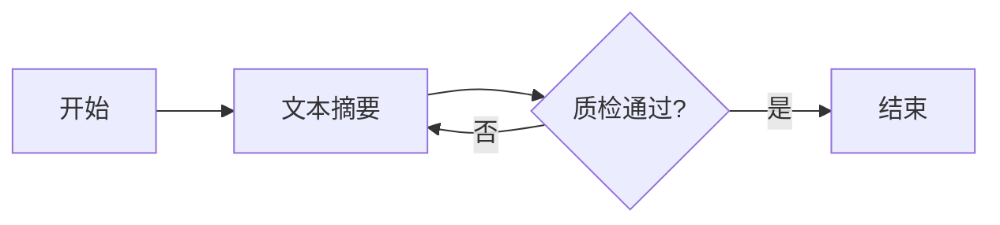

# 工作流脚手架工具设计文档（AI-Native）

> **版本**: 2.0.0
> **创建日期**: 2026-02-04
> **最后更新**: 2026-02-04
> **状态**: 设计阶段，待实施
> **设计理念**: AI-Native - 从模板引擎到智能生成的范式转变

---

## 1. 概述

### 1.1 设计理念转变

#### 传统方案（v1.0）的局限

- **用户体验**: 需要 20+ 个交互式问题，体验冗长
- **技术实现**: 基于模板引擎（Handlebars）的代码填充
- **代码质量**: 模板化生成的代码缺乏灵活性和最佳实践
- **开发周期**: 14-20 天的全流程开发时间
- **维护成本**: 需要持续维护和更新大量模板文件

#### AI-Native 方案（v2.0）的优势

- **用户体验**: 1 句话自然语言描述，AI 自动理解并设计
- **技术实现**: AI 驱动的需求理解 → 智能设计 → 代码生成 → 验证优化
- **代码质量**: AI 基于项目最佳实践生成高质量代码
- **开发周期**: 4-6 天的快速迭代周期
- **智能化**: 持续学习项目架构模式，生成代码越来越智能

### 1.2 核心目标

1. **AI 需求理解引擎** - 从自然语言描述中精确提取工作流需求
2. **智能工作流设计器** - 基于最佳实践自动设计工作流结构
3. **可视化预览系统** - 实时生成 Mermaid 流程图，直观展示工作流设计
4. **AI 代码生成器** - 非模板填充，而是基于理解的智能生成
5. **自动验证与优化** - 生成后自动验证代码质量，并提供优化建议

### 1.3 使用示例对比

#### 传统方案（v1.0）

```bash
# 创建新工作流
pnpm run cli workflow create

# 交互式问答（20+ 个问题）
? 工作流类型标识符 (如: summarizer): summarizer
? 工作流显示名称: 文本摘要工作流
? 工作流描述: 基于LLM的文本摘要生成
? 工作流分类: content
? 添加输入参数 (yes/no): yes
? 参数名: sourceText
? 参数类型: string
? 是否必需: yes
? 参数描述: 待摘要的文本
... (继续 15+ 个问题)

✅ 工作流代码已生成: src/domain/workflows/SummarizerWorkflow.ts
```

#### AI-Native 方案（v2.0）

```bash
# 创建新工作流（一句话描述）
pnpm run cli workflow create "创建一个文本摘要工作流，输入长文本，输出200字摘要，包含质检步骤"

# AI 理解并设计
🤖 AI 正在分析您的需求...
✓ 需求理解完成
  - 工作流类型: text-summarizer
  - 输入参数: sourceText (string)
  - 输出: summarizedText (string, ~200字)
  - 节点设计: summarize → checkQuality

📊 生成工作流预览 (Mermaid):


🤖 AI 正在生成代码...
✓ 状态接口生成完成 (TranslationState.ts)
✓ 节点实现生成完成 (SummarizeNode.ts, CheckQualityNode.ts)
✓ 工作流图生成完成 (SummarizerGraph.ts)
✓ 工厂类生成完成 (SummarizerFactory.ts)
✓ 自动注册完成

✅ 工作流创建成功！
📝 文件位置: src/domain/workflows/TextSummarizerWorkflow.ts
🚀 立即使用: pnpm run cli create --type text-summarizer --sourceText "..."
📖 查看文档: pnpm run cli workflow info text-summarizer
```

---

## 2. 系统架构设计

### 2.1 整体架构

```
┌─────────────────────────────────────────────────────────────────┐
│                     CLI 入口层                                    │
│  pnpm run cli workflow create "<自然语言描述>"                   │
└──────────────────────┬──────────────────────────────────────────┘
                       │
                       ▼
┌─────────────────────────────────────────────────────────────────┐
│              AI 需求理解引擎（核心）                              │
│  - LLM 解析自然语言描述                                          │
│  - 提取工作流元数据、参数、节点、流程                            │
│  - 生成结构化需求规范 (JSON Schema)                             │
└──────────────────────┬──────────────────────────────────────────┘
                       │
                       ▼
┌─────────────────────────────────────────────────────────────────┐
│           智能工作流设计器（AI-Driven）                           │
│  - 基于项目最佳实践设计节点结构                                  │
│  - 智能推荐节点类型和连接关系                                    │
│  - 自动设计状态接口、路由逻辑                                    │
└──────────────────────┬──────────────────────────────────────────┘
                       │
        ┌──────────────┼──────────────┐
        │              │              │
        ▼              ▼              ▼
┌──────────────┐ ┌──────────┐ ┌──────────────────┐
│ 可视化预览   │ │ AI 代码  │ │ 自动验证与优化   │
│              │ │ 生成器   │ │                  │
│ - Mermaid 图 │ │ - 智能   │ │ - 代码质量检查  │
│ - 节点关系   │ │ 生成     │ │ - 类型验证      │
│ - 数据流     │ │ - 非模板 │ │ - 最佳实践验证  │
└──────────────┘ └──────────┘ └──────────────────┘
                       │
                       ▼
┌─────────────────────────────────────────────────────────────────┐
│                      自动注册                                    │
│  - 生成文件写入                                                 │
│  - WorkflowRegistry 注册                                        │
│  - CLI 参数映射更新                                             │
└─────────────────────────────────────────────────────────────────┘
```

### 2.2 核心模块

#### 2.2.1 AI 需求理解引擎（AINeuralUnderstandingEngine）

**文件位置**: `src/presentation/cli/scaffolding/ai/AINeuralUnderstandingEngine.ts`

```typescript
interface WorkflowRequirement {
  // 基本信息
  type: string;                    // AI 推断的工作流类型
  name: string;                    // AI 生成的显示名称
  description: string;             // AI 生成的描述
  category: string;                // AI 推断的分类
  tags: string[];                  // AI 推断的标签

  // 参数定义
  inputParams: ParamDefinition[];  // AI 提取的输入参数
  outputFields: string[];          // AI 推断的输出字段

  // 节点设计
  nodes: NodeDesign[];             // AI 设计的节点列表
  nodeConnections: Connection[];   // AI 设计的节点连接关系

  // 工作流配置
  enableQualityCheck: boolean;     // AI 推断是否需要质检
  maxRetries: number;              // AI 推断的重试次数
  enableCheckpoint: boolean;       // AI 推断是否需要检查点
}

interface NodeDesign {
  name: string;                    // 节点名称
  displayName: string;             // 显示名称
  description: string;             // 节点功能描述
  nodeType: NodeType;              // AI 推断的节点类型
  timeout: number;                 // AI 推断的超时时间
  useLLM: boolean;                 // AI 推断是否使用 LLM
  llmSystemPrompt?: string;        // AI 生成的 LLM 系统提示词
  enableQualityCheck: boolean;     // AI 推断是否启用质检
  qualityCheckPrompt?: string;     // AI 生成的质检提示词
  dependencies: string[];          // 依赖的前置节点
}

interface AINeuralUnderstandingEngine {
  /**
   * 从自然语言描述理解工作流需求
   *
   * @param naturalLanguageDescription - 自然语言描述
   * @param context - 项目上下文（现有工作流、代码模式等）
   * @returns 结构化需求规范
   */
  understandRequirement(
    naturalLanguageDescription: string,
    context?: ProjectContext
  ): Promise<WorkflowRequirement>;

  /**
   * 验证需求完整性和合理性
   *
   * @param requirement - 需求规范
   * @returns 验证结果和改进建议
   */
  validateRequirement(
    requirement: WorkflowRequirement
  ): Promise<ValidationResult>;

  /**
   * 优化需求设计（基于最佳实践）
   *
   * @param requirement - 原始需求
   * @returns 优化后的需求
   */
  optimizeRequirement(
    requirement: WorkflowRequirement
  ): Promise<WorkflowRequirement>;
}
```

#### 2.2.2 智能工作流设计器（AIWorkflowDesigner）

**文件位置**: `src/presentation/cli/scaffolding/ai/AIWorkflowDesigner.ts`

```typescript
interface AIWorkflowDesigner {
  /**
   * 设计状态接口
   *
   * @param requirement - 需求规范
   * @returns 状态接口 TypeScript 代码
   */
  designStateInterface(requirement: WorkflowRequirement): Promise<string>;

  /**
   * 设计节点类
   *
   * @param nodeDesign - 节点设计
   * @param projectPatterns - 项目中的节点实现模式
   * @returns 节点类 TypeScript 代码
   */
  designNodeClass(
    nodeDesign: NodeDesign,
    projectPatterns?: ProjectPatterns
  ): Promise<string>;

  /**
   * 设计路由函数
   *
   * @param nodes - 节点列表
   * @param connections - 节点连接关系
   * @returns 路由函数 TypeScript 代码
   */
  designRouteFunctions(
    nodes: NodeDesign[],
    connections: Connection[]
  ): Promise<string>;

  /**
   * 设计工作流图
   *
   * @param requirement - 需求规范
   * @param stateInterface - 状态接口代码
   * @param nodes - 节点代码
   * @param routeFunctions - 路由函数代码
   * @returns 工作流图 TypeScript 代码
   */
  designWorkflowGraph(
    requirement: WorkflowRequirement,
    stateInterface: string,
    nodes: string[],
    routeFunctions: string
  ): Promise<string>;

  /**
   * 设计工厂类
   *
   * @param requirement - 需求规范
   * @param workflowGraph - 工作流图代码
   * @returns 工厂类 TypeScript 代码
   */
  designFactoryClass(
    requirement: WorkflowRequirement,
    workflowGraph: string
  ): Promise<string>;
}
```

#### 2.2.3 可视化预览系统（VisualizationPreviewSystem）

**文件位置**: `src/presentation/cli/scaffolding/visualization/VisualizationPreviewSystem.ts`

```typescript
interface VisualizationPreviewSystem {
  /**
   * 生成 Mermaid 流程图
   *
   * @param requirement - 需求规范
   * @returns Mermaid 图表代码
   */
  generateMermaidDiagram(requirement: WorkflowRequirement): string;

  /**
   * 生成节点关系表
   *
   * @param nodes - 节点列表
   * @param connections - 连接关系
   * @returns ASCII 表格
   */
  generateNodeTable(nodes: NodeDesign[], connections: Connection[]): string;

  /**
   * 生成数据流图
   *
   * @param inputParams - 输入参数
   * @param nodes - 节点列表
   * @param outputFields - 输出字段
   * @returns 数据流图（ASCII）
   */
  generateDataFlowDiagram(
    inputParams: ParamDefinition[],
    nodes: NodeDesign[],
    outputFields: string[]
  ): string;

  /**
   * 在终端显示预览
   *
   * @param requirement - 需求规范
   */
  displayPreview(requirement: WorkflowRequirement): Promise<void>;
}
```

#### 2.2.4 AI 代码生成器（AICodeGenerator）

**文件位置**: `src/presentation/cli/scaffolding/ai/AICodeGenerator.ts`

```typescript
interface AICodeGenerator {
  /**
   * 生成完整工作流代码
   *
   * @param requirement - 优化后的需求规范
   * @param projectContext - 项目上下文（现有代码模式、最佳实践）
   * @returns 生成的文件集合
   */
  generateWorkflow(
    requirement: WorkflowRequirement,
    projectContext: ProjectContext
  ): Promise<WorkflowFiles>;

  /**
   * 生成单个文件代码
   *
   * @param fileType - 文件类型（state | node | graph | factory）
   * @param requirement - 需求规范
   * @param projectPatterns - 项目代码模式
   * @returns 生成的代码
   */
  generateFile(
    fileType: 'state' | 'node' | 'graph' | 'factory',
    requirement: WorkflowRequirement,
    projectPatterns?: ProjectPatterns
  ): Promise<string>;
}

interface WorkflowFiles {
  state: string;                   // 状态接口代码
  nodes: Map<string, string>;      // 节点代码（节点名 -> 代码）
  graph: string;                   // 工作流图代码
  factory: string;                 // 工厂类代码
  index: string;                   // 导出文件代码
}

interface ProjectPatterns {
  // 从项目中提取的代码模式
  stateInterfacePatterns: string[];   // 状态接口模式
  nodeClassPatterns: string[];        // 节点类模式
  graphPatterns: string[];            // 工作流图模式
  factoryPatterns: string[];          // 工厂类模式
}
```

#### 2.2.5 自动验证与优化器（AutoValidatorOptimizer）

**文件位置**: `src/presentation/cli/scaffolding/validation/AutoValidatorOptimizer.ts`

```typescript
interface AutoValidatorOptimizer {
  /**
   * 验证生成的代码质量
   *
   * @param files - 生成的文件
   * @returns 验证结果（问题列表、建议）
   */
  validateCode(files: WorkflowFiles): Promise<CodeValidationResult>;

  /**
   * TypeScript 类型检查
   *
   * @param code - TypeScript 代码
   * @returns 类型检查结果
   */
  checkTypeScript(code: string): Promise<TypeCheckResult>;

  /**
   * 最佳实践验证
   *
   * @param code - TypeScript 代码
   * @param projectPatterns - 项目最佳实践模式
   * @returns 最佳实践检查结果
   */
  checkBestPractices(
    code: string,
    projectPatterns: ProjectPatterns
  ): Promise<BestPracticeResult>;

  /**
   * 优化代码（基于 AI）
   *
   * @param code - 原始代码
   * @param issues - 发现的问题
   * @returns 优化后的代码
   */
  optimizeCode(code: string, issues: CodeIssue[]): Promise<string>;
}

interface CodeValidationResult {
  valid: boolean;
  errors: CodeIssue[];
  warnings: CodeIssue[];
  suggestions: CodeSuggestion[];
  overallScore: number;  // 0-100
}

interface CodeIssue {
  severity: 'error' | 'warning' | 'info';
  category: 'syntax' | 'type' | 'best-practice' | 'performance' | 'security';
  message: string;
  line?: number;
  column?: number;
  fix?: string;  // AI 生成的修复建议
}

interface CodeSuggestion {
  category: 'optimization' | 'readability' | 'maintainability' | 'extensibility';
  message: string;
  improvedCode?: string;
  reason: string;
}
```

---

## 3. AI 需求理解引擎设计

### 3.1 工作原理

```
自然语言描述
    │
    ▼
┌─────────────────────────────────────┐
│  LLM Prompt Engineering             │
│  - 分析项目架构文档                 │
│  - 分析现有工作流模式               │
│  - 构建结构化提取 Prompt             │
└──────────────┬──────────────────────┘
               │
               ▼
┌─────────────────────────────────────┐
│  LLM 调用（DeepSeek/Claude）        │
│  - 输入：自然语言 + 上下文          │
│  - 输出：结构化 JSON                 │
└──────────────┬──────────────────────┘
               │
               ▼
┌─────────────────────────────────────┐
│  结构化提取与验证                   │
│  - JSON Schema 验证                 │
│  - 完整性检查                       │
│  - 合理性验证                       │
└──────────────┬──────────────────────┘
               │
               ▼
         WorkflowRequirement
```

### 3.2 Prompt 模板设计

```typescript
const WORKFLOW_UNDERSTANDING_PROMPT = `
你是一位专业的工作流架构专家。请根据用户的自然语言描述，分析并设计一个 LangGraph 工作流。

# 项目上下文

## 工作流系统架构
- 基于 LangGraph 的状态机工作流
- 所有节点继承自 BaseNode<TState>
- 状态接口继承自 BaseWorkflowState
- 工作流必须实现 WorkflowFactory 接口

## 现有工作流示例
{EXISTING_WORKFLOWS}

## 项目代码模式
{PROJECT_PATTERNS}

# 任务要求

请分析用户的自然语言描述，提取以下信息并以 JSON 格式返回：

## 基本信息
- type: 工作流类型标识符（kebab-case，如: text-summarizer）
- name: 工作流显示名称（中文，简洁明了）
- description: 工作流描述（1-2句话，说明功能和用途）
- category: 工作流分类（content | translation | analysis | automation | other）
- tags: 标签数组（llm | quality-check | batch | real-time | multi-step）

## 输入参数
根据描述提取所需的输入参数：
- name: 参数名（camelCase）
- type: 参数类型（string | number | boolean | array | object）
- required: 是否必需
- description: 参数描述
- examples: 示例值数组

## 节点设计
根据功能需求设计节点：
- name: 节点名称（camelCase，如: summarize）
- displayName: 显示名称（中文，如: 文本摘要）
- description: 节点功能描述
- nodeType: 节点类型（llm | api | transform | quality_check | custom）
- timeout: 超时时间（毫秒，根据复杂度推断）
- useLLM: 是否使用 LLM（根据 nodeType 推断）
- enableQualityCheck: 是否需要质检（根据需求推断）
- dependencies: 依赖的前置节点（数组）

## 节点连接关系
设计节点间的执行顺序和条件分支：
- from: 源节点
- to: 目标节点
- condition: 条件（可选，如: "passed === true"）

## 工作流配置
- enableQualityCheck: 是否全局启用质检
- maxRetries: 最大重试次数（默认 3）
- enableCheckpoint: 是否启用检查点（默认 true）

# 用户的自然语言描述

{USER_DESCRIPTION}

# 输出要求

请严格按照以下 JSON Schema 返回结果：

\`\`\`json
{
  "type": "string",
  "name": "string",
  "description": "string",
  "category": "string",
  "tags": ["string"],
  "inputParams": [
    {
      "name": "string",
      "type": "string",
      "required": boolean,
      "description": "string",
      "examples": ["string"]
    }
  ],
  "nodes": [
    {
      "name": "string",
      "displayName": "string",
      "description": "string",
      "nodeType": "string",
      "timeout": number,
      "useLLM": boolean,
      "enableQualityCheck": boolean,
      "dependencies": ["string"]
    }
  ],
  "connections": [
    {
      "from": "string",
      "to": "string",
      "condition": "string (optional)"
    }
  ],
  "enableQualityCheck": boolean,
  "maxRetries": number,
  "enableCheckpoint": boolean
}
\`\`\`

# 注意事项

1. type 必须是 kebab-case（小写字母、数字、连字符）
2. 节点名称必须是 camelCase
3. 节点执行顺序必须合理（有依赖关系的节点按依赖排序）
4. 如果涉及 LLM 生成内容，建议添加质检节点
5. 如果描述中提到"重试"、"失败"等词，应设计条件分支
6. 确保所有必需字段都有值
7. 示例值要真实可用

现在请分析用户的描述并返回 JSON 结果。
`;
```

### 3.3 上下文构建

```typescript
interface ProjectContext {
  existingWorkflows: WorkflowMetadata[];  // 现有工作流列表
  codePatterns: ProjectPatterns;          // 项目代码模式
  bestPractices: string[];                // 最佳实践列表
  commonNodes: string[];                  // 常用节点类型
}

async function buildProjectContext(): Promise<ProjectContext> {
  // 1. 获取现有工作流
  const existingWorkflows = WorkflowRegistry.listWorkflows();

  // 2. 提取代码模式
  const codePatterns = await extractCodePatterns();

  // 3. 提取最佳实践
  const bestPractices = await extractBestPractices();

  // 4. 识别常用节点
  const commonNodes = identifyCommonNodes(existingWorkflows);

  return {
    existingWorkflows,
    codePatterns,
    bestPractices,
    commonNodes,
  };
}

async function extractCodePatterns(): Promise<ProjectPatterns> {
  // 扫描现有工作流文件，提取代码模式
  const workflowFiles = await glob('src/domain/workflow/**/*.ts');

  const patterns: ProjectPatterns = {
    stateInterfacePatterns: [],
    nodeClassPatterns: [],
    graphPatterns: [],
    factoryPatterns: [],
  };

  for (const file of workflowFiles) {
    const content = await fs.readFile(file, 'utf-8');

    // 提取状态接口模式
    if (content.includes('extends BaseWorkflowState')) {
      patterns.stateInterfacePatterns.push(content);
    }

    // 提取节点类模式
    if (content.includes('extends BaseNode')) {
      patterns.nodeClassPatterns.push(content);
    }

    // 提取工作流图模式
    if (content.includes('StateGraph') && content.includes('createGraph')) {
      patterns.graphPatterns.push(content);
    }

    // 提取工厂类模式
    if (content.includes('implements WorkflowFactory')) {
      patterns.factoryPatterns.push(content);
    }
  }

  return patterns;
}
```

### 3.4 Few-Shot Learning 示例

```typescript
const FEW_SHOT_EXAMPLES = [
  {
    description: '创建一个文本摘要工作流，输入长文本，输出200字摘要，包含质检步骤',
    expectedOutput: {
      type: 'text-summarizer',
      name: '文本摘要工作流',
      description: '基于 LLM 的智能文本摘要生成工作流',
      category: 'content',
      tags: ['llm', 'quality-check', 'content'],
      inputParams: [
        {
          name: 'sourceText',
          type: 'string',
          required: true,
          description: '待摘要的长文本',
          examples: ['这是一篇很长的文章内容...'],
        },
        {
          name: 'maxLength',
          type: 'number',
          required: false,
          description: '摘要最大长度',
          examples: [200, 300],
        },
      ],
      nodes: [
        {
          name: 'summarize',
          displayName: '文本摘要',
          description: '使用 LLM 生成文本摘要',
          nodeType: 'llm',
          timeout: 120000,
          useLLM: true,
          enableQualityCheck: false,
          dependencies: [],
        },
        {
          name: 'checkQuality',
          displayName: '质检',
          description: '检查摘要质量',
          nodeType: 'quality_check',
          timeout: 60000,
          useLLM: true,
          enableQualityCheck: false,
          dependencies: ['summarize'],
        },
      ],
      connections: [
        { from: 'START', to: 'summarize' },
        { from: 'summarize', to: 'checkQuality' },
        {
          from: 'checkQuality',
          to: '__end__',
          condition: 'passed === true',
        },
        {
          from: 'checkQuality',
          to: 'summarize',
          condition: 'passed === false && retryCount < 2',
        },
      ],
      enableQualityCheck: true,
      maxRetries: 2,
      enableCheckpoint: true,
    },
  },
  // ... 更多示例
];
```

---

## 4. 可视化预览系统设计

### 4.1 Mermaid 流程图生成

```typescript
class MermaidDiagramGenerator implements VisualizationPreviewSystem {
  generateMermaidDiagram(requirement: WorkflowRequirement): string {
    let mermaid = 'graph LR\n';
    mermaid += '    A[开始] -->';

    // 添加节点
    const nodeMap = new Map<string, string>();
    requirement.nodes.forEach((node, index) => {
      const nodeId = String.fromCharCode(66 + index); // B, C, D, ...
      nodeMap.set(node.name, nodeId);
      mermaid += ` ${nodeId}[${node.displayName}] -->`;
    });

    mermaid = mermaid.slice(0, -3); // 移除最后的 "-->"
    mermaid += '\n';

    // 添加连接关系
    requirement.connections.forEach((conn) => {
      const fromId = conn.from === 'START' ? 'A' : nodeMap.get(conn.from);
      const toId = conn.to === '__end__' ? 'Z[结束]' : nodeMap.get(conn.to);

      if (conn.condition) {
        mermaid += `    ${fromId} -->|${conn.condition}| ${toId}\n`;
      } else {
        mermaid += `    ${fromId} --> ${toId}\n`;
      }
    });

    return mermaid;
  }

  displayPreview(requirement: WorkflowRequirement): Promise<void> {
    console.log('\n📊 工作流预览\n');

    // 显示 Mermaid 图
    console.log('Mermaid 流程图:');
    console.log('```mermaid');
    console.log(this.generateMermaidDiagram(requirement));
    console.log('```\n');

    // 显示节点表
    console.log('节点列表:');
    console.log(this.generateNodeTable(requirement.nodes, requirement.connections));

    // 显示数据流
    console.log('\n数据流:');
    console.log(
      this.generateDataFlowDiagram(
        requirement.inputParams,
        requirement.nodes,
        requirement.outputFields
      )
    );

    return Promise.resolve();
  }
}
```

### 4.2 节点关系表生成

```typescript
generateNodeTable(nodes: NodeDesign[], connections: Connection[]): string {
  let table = '\n┌─────────────┬──────────┬────────────┬────────────┐\n';
  table += '│ 节点名称    │ 类型     │ 超时时间   │ 依赖节点   │\n';
  table += '├─────────────┼──────────┼────────────┼────────────┤\n';

  nodes.forEach((node) => {
    const name = node.displayName.padEnd(11);
    const type = node.nodeType.padEnd(10);
    const timeout = `${node.timeout / 1000}s`.padEnd(12);
    const deps = node.dependencies.join(', ').padEnd(12);

    table += `│ ${name} │ ${type} │ ${timeout} │ ${deps} │\n`;
  });

  table += '└─────────────┴──────────┴────────────┴────────────┘\n';

  return table;
}
```

### 4.3 数据流图生成

```typescript
generateDataFlowDiagram(
  inputParams: ParamDefinition[],
  nodes: NodeDesign[],
  outputFields: string[]
): string {
  let diagram = '\n';

  // 输入参数
  diagram += '┌─ 输入参数 ─────────────────────────────┐\n';
  inputParams.forEach((param) => {
    const required = param.required ? '*' : '';
    diagram += `  • ${param.name}: ${param.type}${required}\n`;
  });

  // 节点处理
  diagram += '\n┌─ 节点处理 ─────────────────────────────┐\n';
  nodes.forEach((node) => {
    diagram += `  ${node.displayName} (${node.name})\n`;
    if (node.useLLM) {
      diagram += `    └─ 使用 LLM\n`;
    }
    if (node.enableQualityCheck) {
      diagram += `    └─ 包含质检\n`;
    }
  });

  // 输出字段
  diagram += '\n┌─ 输出结果 ─────────────────────────────┐\n';
  outputFields.forEach((field) => {
    diagram += `  • ${field}\n`;
  });

  return diagram;
}
```

---

## 5. AI 代码生成器设计

### 5.1 代码生成流程

```
WorkflowRequirement
    │
    ▼
┌─────────────────────────────────────┐
│  生成上下文构建                     │
│  - 加载项目代码模式                 │
│  - 加载最佳实践                     │
│  - 加载现有工作流示例               │
└──────────────┬──────────────────────┘
               │
               ▼
┌─────────────────────────────────────┐
│  LLM 代码生成（分步）               │
│  1. 生成状态接口                    │
│  2. 生成节点类（每个节点）          │
│  3. 生成路由函数                    │
│  4. 生成工作流图                    │
│  5. 生成工厂类                      │
└──────────────┬──────────────────────┘
               │
               ▼
┌─────────────────────────────────────┐
│  代码后处理                         │
│  - Prettier 格式化                  │
│  - ESLint 检查                      │
│  - TypeScript 编译验证              │
└──────────────┬──────────────────────┘
               │
               ▼
         WorkflowFiles
```

### 5.2 状态接口生成 Prompt

```typescript
const STATE_INTERFACE_GENERATION_PROMPT = `
你是一位 TypeScript 专家。请根据工作流需求生成状态接口代码。

# 项目上下文

## BaseWorkflowState 接口
\`\`\`typescript
interface BaseWorkflowState {
  taskId: string;
  workflowType: string;
  mode: ExecutionMode;
  currentStep: string;
  retryCount: number;
  version: number;
  startTime: number;
  endTime?: number;
  error?: string;
  metadata?: any;
}
\`\`\`

## 现有状态接口示例
{STATE_INTERFACE_EXAMPLES}

# 任务要求

请生成符合以下需求的状态接口：

## 工作流需求
\`\`\`json
${JSON.stringify(requirement, null, 2)}
\`\`\`

# 生成要求

1. 接口名称：{StateName}（如: TranslationState）
2. 继承 BaseWorkflowState
3. 包含以下部分：
   - 输入参数（从 inputParams 提取）
   - 流程数据（从 nodes 推断）
   - 质检数据（如果 enableQualityCheck）
   - 控制数据（重试计数等）
4. 每个字段添加 JSDoc 注释
5. 遵循项目代码风格

# 输出格式

请只输出 TypeScript 代码，不要任何额外说明。

\`\`\`typescript
// 生成的状态接口代码
\`\`\`
`;
```

### 5.3 节点类生成 Prompt

```typescript
const NODE_CLASS_GENERATION_PROMPT = `
你是一位 TypeScript 和 LangGraph 专家。请根据节点设计生成节点类代码。

# 项目上下文

## BaseNode 基类
\`\`\`typescript
export abstract class BaseNode<TState extends BaseWorkflowState> {
  protected readonly name: string;
  protected readonly retryCount: number;
  protected readonly timeout: number;
  protected readonly logger;

  constructor(config: NodeConfig) { ... }

  protected abstract executeLogic(state: TState): Promise<Partial<TState>>;

  protected validateState(state: TState): void { ... }

  protected extractJSON(content: string): string { ... }

  toLangGraphNode(): (state: TState) => Promise<Partial<TState>> { ... }
}
\`\`\`

## 现有节点示例
{NODE_CLASS_EXAMPLES}

## 状态接口
\`\`\`typescript
${stateInterface}
\`\`\`

# 任务要求

请生成以下节点类：

## 节点设计
\`\`\`json
${JSON.stringify(nodeDesign, null, 2)}
\`\`\`

# 生成要求

1. 类名：{NodeName}（如: SummarizeNode）
2. 继承 BaseNode<{StateName}>
3. 实现以下方法：
   - executeLogic(): 核心逻辑
   - validateState(): 输入验证（可选）
4. 如果 useLLM = true：
   - 添加 buildPrompt() 方法
   - 调用 enhancedLLMService.chat()
5. 如果 enableQualityCheck = true：
   - 设计质检逻辑
6. 添加详细的日志记录
7. 添加 JSDoc 注释
8. 遵循项目代码风格

# LLM 服务调用示例

\`\`\`typescript
const result = await enhancedLLMService.chat({
  messages: [
    { role: 'system', content: '系统提示词' },
    { role: 'user', content: '用户提示词' },
  ],
  taskId: state.taskId,
  stepName: this.name,
  stream: true,
});
\`\`\`

# 输出格式

请只输出 TypeScript 代码，不要任何额外说明。

\`\`\`typescript
// 生成的节点类代码
\`\`\`
`;
```

### 5.4 工作流图生成 Prompt

```typescript
const WORKFLOW_GRAPH_GENERATION_PROMPT = `
你是一位 LangGraph 专家。请根据工作流需求生成工作流图代码。

# 项目上下文

## LangGraph StateGraph 示例
\`\`\`typescript
const graph = new StateGraph<StateInterface>({
  channels: {
    taskId: {
      default: () => '',
      reducer: (x?: string, y?: string) => y ?? x ?? '',
    },
    // ... 其他字段
  },
});

graph.addNode('nodeName', nodeInstance);
graph.addEdge(START, 'nodeName');
graph.addConditionalEdges('nodeName', routeFunction, {
  nextNode: 'nextNode',
  __end__: END,
});

return graph.compile();
\`\`\`

## 现有工作流图示例
{WORKFLOW_GRAPH_EXAMPLES}

## 状态接口
\`\`\`typescript
${stateInterface}
\`\`\`

## 节点实例
${nodes.map((node) => `const ${node.name}Node = new ${toPascalCase(node.name)}().toLangGraphNode();`).join('\n')}

# 任务要求

请生成工作流图代码：

## 节点连接关系
\`\`\`json
${JSON.stringify(connections, null, 2)}
\`\`\`

# 生成要求

1. 定义 StateGraph 的 channels：
   - 基础字段（从 BaseWorkflowState 继承）
   - 输入参数（从 inputParams）
   - 流程数据（从 nodes 推断）
   - 质检数据（如果 enableQualityCheck）
   - 控制数据（重试计数等）
2. 添加所有节点
3. 设置入口点（START → 第一个节点）
4. 添加边（addEdge 和 addConditionalEdges）
5. 编译并返回

# 输出格式

请只输出 TypeScript 代码，不要任何额外说明。

\`\`\`typescript
// 生成的工作流图代码
\`\`\`
`;
```

---

## 6. 自动验证与优化设计

### 6.1 验证流程

```
生成的代码
    │
    ▼
┌─────────────────────────────────────┐
│  TypeScript 编译检查                │
│  - tsc --noEmit                     │
│  - 类型检查                         │
└──────────────┬──────────────────────┘
               │
               ▼
┌─────────────────────────────────────┐
│  ESLint 代码质量检查                │
│  - 代码风格                         │
│  - 潜在问题                         │
└──────────────┬──────────────────────┘
               │
               ▼
┌─────────────────────────────────────┐
│  最佳实践验证（AI）                 │
│  - 与项目模式对比                   │
│  - 性能检查                         │
│  - 安全检查                         │
└──────────────┬──────────────────────┘
               │
               ▼
┌─────────────────────────────────────┐
│  自动优化（AI）                     │
│  - 修复发现的问题                   │
│  - 优化代码结构                     │
└──────────────┬──────────────────────┘
               │
               ▼
         优化后的代码
```

### 6.2 AI 验证 Prompt

```typescript
const CODE_VALIDATION_PROMPT = `
你是一位代码审查专家。请检查生成的 TypeScript 代码质量。

# 项目上下文

## 代码规范
{PROJECT_BEST_PRACTICES}

## 代码模式示例
{PROJECT_PATTERNS}

# 待验证代码

\`\`\`typescript
${code}
\`\`\`

# 验证维度

请从以下维度检查代码：

1. **类型安全**
   - TypeScript 类型是否正确
   - 是否存在 any 类型滥用
   - 泛型使用是否合理

2. **代码风格**
   - 命名规范（camelCase, PascalCase）
   - 代码格式
   - 注释质量

3. **最佳实践**
   - 是否符合项目模式
   - 错误处理是否完善
   - 日志记录是否充分

4. **性能**
   - 是否存在性能问题
   - 资源使用是否合理

5. **可维护性**
   - 代码是否易于理解
   - 结构是否清晰
   - 是否易于扩展

# 输出格式

请以 JSON 格式返回验证结果：

\`\`\`json
{
  "valid": boolean,
  "score": number,  // 0-100
  "errors": [
    {
      "severity": "error",
      "category": "type|style|best-practice|performance|security",
      "message": "问题描述",
      "line": number,
      "fix": "修复建议"
    }
  ],
  "warnings": [...],
  "suggestions": [
    {
      "category": "optimization|readability|maintainability|extensibility",
      "message": "优化建议",
      "improvedCode": "改进后的代码片段",
      "reason": "改进原因"
    }
  ]
}
\`\`\`

现在请检查代码并返回 JSON 结果。
`;
```

### 6.3 自动优化

```typescript
async function optimizeCode(
  code: string,
  issues: CodeIssue[]
): Promise<string> {
  if (issues.length === 0) {
    return code;
  }

  const optimizationPrompt = `
你是一位代码优化专家。请根据发现的问题优化以下 TypeScript 代码。

# 原始代码

\`\`\`typescript
${code}
\`\`\`

# 发现的问题

${issues.map((issue) => `- [${issue.severity}] ${issue.message}（行 ${issue.line}）`).join('\n')}

# 优化要求

1. 修复所有错误（error）
2. 尽可能修复警告（warning）
3. 应用建议（suggestions）以提高代码质量
4. 保持原有功能和逻辑
5. 遵循项目代码风格
6. 添加或改进注释

# 输出格式

请只输出优化后的 TypeScript 代码，不要任何额外说明。

\`\`\`typescript
// 优化后的代码
\`\`\`
`;

  const optimizedCode = await llmService.chat({
    messages: [{ role: 'user', content: optimizationPrompt }],
    stream: false,
  });

  return optimizedCode.content.trim();
}
```

---

## 7. CLI 命令设计

### 7.1 主命令

```bash
# 创建新工作流（AI-Native 方式）
pnpm run cli workflow create "<自然语言描述>"

# 示例：
pnpm run cli workflow create "创建一个文本摘要工作流，输入长文本，输出200字摘要，包含质检步骤"
pnpm run cli workflow create "翻译工作流，支持中英日互译，带质检和重试"
pnpm run cli workflow create "批量图片生成工作流，输入文本描述，生成4张不同风格的图片"

# 交互式确认模式
pnpm run cli workflow create "<描述>" --interactive

# 直接生成模式（跳过确认）
pnpm run cli workflow create "<描述>" --yes

# 仅生成预览（不实际创建）
pnpm run cli workflow create "<描述>" --preview

# 保存设计规范（供后续使用）
pnpm run cli workflow create "<描述>" --save-spec workflow-spec.json

# 从规范文件创建
pnpm run cli workflow create --from-spec workflow-spec.json
```

### 7.2 辅助命令

```bash
# 列出所有工作流
pnpm run cli workflow list

# 查看工作流详情
pnpm run cli workflow info <workflow-type>

# 验证工作流
pnpm run cli workflow validate <workflow-type>

# 导出工作流规范
pnpm run cli workflow export <workflow-type> --output spec.json

# 删除工作流
pnpm run cli workflow remove <workflow-type>

# 比较 AI 生成 vs 手动编写
pnpm run cli workflow diff <workflow-type>
```

### 7.3 命令实现

```typescript
import { Command } from 'commander';
import { AINeuralUnderstandingEngine } from '../ai/AINeuralUnderstandingEngine.js';
import { AIWorkflowDesigner } from '../ai/AIWorkflowDesigner.js';
import { VisualizationPreviewSystem } from '../visualization/VisualizationPreviewSystem.js';
import { AICodeGenerator } from '../ai/AICodeGenerator.js';
import { AutoValidatorOptimizer } from '../validation/AutoValidatorOptimizer.js';

export const createWorkflowCommand = new Command('create')
  .description('创建新的工作流（AI-Native）')
  .argument('<description>', '自然语言描述工作流需求')
  .option('-i, --interactive', '交互式确认模式')
  .option('-y, --yes', '跳过所有确认，直接生成')
  .option('-p, --preview', '仅生成预览，不实际创建')
  .option('--save-spec <file>', '保存设计规范到文件')
  .option('--from-spec <file>', '从规范文件创建')
  .action(async (description: string, options) => {
    try {
      // 1. 构建项目上下文
      const context = await buildProjectContext();

      // 2. AI 理解需求
      console.log('🤖 AI 正在分析您的需求...');
      const understandingEngine = new AINeuralUnderstandingEngine();

      let requirement: WorkflowRequirement;

      if (options.fromSpec) {
        // 从规范文件加载
        requirement = JSON.parse(await fs.readFile(options.fromSpec, 'utf-8'));
      } else {
        // AI 理解自然语言
        requirement = await understandingEngine.understandRequirement(
          description,
          context
        );
      }

      console.log('✓ 需求理解完成');
      console.log(`  - 工作流类型: ${requirement.type}`);
      console.log(`  - 节点数量: ${requirement.nodes.length}`);

      // 3. AI 优化设计
      console.log('\n🤖 AI 正在优化工作流设计...');
      const designer = new AIWorkflowDesigner();
      const optimizedRequirement = await designer.optimizeRequirement(requirement);
      console.log('✓ 设计优化完成');

      // 4. 可视化预览
      console.log('\n📊 生成工作流预览...');
      const visualizer = new VisualizationPreviewSystem();
      await visualizer.displayPreview(optimizedRequirement);

      // 5. 交互式确认
      if (options.interactive && !options.yes) {
        const confirmed = await confirm('确认生成工作流？');
        if (!confirmed) {
          console.log('❌ 已取消');
          return;
        }
      }

      if (options.preview) {
        console.log('\n✅ 预览模式，不实际创建');
        if (options.saveSpec) {
          await fs.writeFile(
            options.saveSpec,
            JSON.stringify(optimizedRequirement, null, 2)
          );
          console.log(`📝 规范已保存: ${options.saveSpec}`);
        }
        return;
      }

      // 6. AI 生成代码
      console.log('\n🤖 AI 正在生成代码...');
      const codeGenerator = new AICodeGenerator();
      const files = await codeGenerator.generateWorkflow(
        optimizedRequirement,
        context
      );

      console.log('✓ 代码生成完成');

      // 7. 自动验证与优化
      console.log('\n🔍 正在验证代码质量...');
      const validator = new AutoValidatorOptimizer();
      const validation = await validator.validateCode(files);

      console.log(`✓ 验证完成（得分: ${validation.overallScore}/100）`);

      if (validation.errors.length > 0) {
        console.log(`⚠️  发现 ${validation.errors.length} 个错误，正在修复...`);
        // 自动修复
      }

      if (validation.warnings.length > 0) {
        console.log(`⚠️  发现 ${validation.warnings.length} 个警告`);
      }

      // 8. 写入文件
      console.log('\n📝 正在写入文件...');
      const fileName = `${toPascalCase(optimizedRequirement.type)}Workflow.ts`;
      const filePath = path.join(workflowsDir, fileName);

      await fs.writeFile(filePath, files.index, 'utf-8');
      console.log(`✓ 工作流文件: ${filePath}`);

      // 9. 自动注册
      console.log('\n🔧 正在注册工作流...');
      await registerWorkflow(fileName, optimizedRequirement);
      console.log('✓ 注册完成');

      // 10. 保存规范（如果需要）
      if (options.saveSpec) {
        await fs.writeFile(
          options.saveSpec,
          JSON.stringify(optimizedRequirement, null, 2)
        );
        console.log(`📝 规范已保存: ${options.saveSpec}`);
      }

      // 11. 完成
      console.log('\n✅ 工作流创建成功！');
      console.log(`📁 文件位置: ${filePath}`);
      console.log(`🚀 立即使用: pnpm run cli create --type ${optimizedRequirement.type} --<参数> <值>`);
      console.log(`📖 查看详情: pnpm run cli workflow info ${optimizedRequirement.type}`);

      if (validation.suggestions.length > 0) {
        console.log('\n💡 优化建议:');
        validation.suggestions.slice(0, 3).forEach((s, i) => {
          console.log(`  ${i + 1}. ${s.message}`);
        });
      }
    } catch (error) {
      console.error('❌ 创建失败:', error);
      process.exit(1);
    }
  });
```

---

## 8. 技术栈更新

### 8.1 核心依赖

| 依赖 | 版本 | 用途 |
|------|------|------|
| **@langchain/langgraph** | ^0.2.0 | LangGraph 工作流引擎 |
| **openai** | ^4.0.0 | LLM API 调用（GPT-4） |
| **@anthropic-ai/sdk** | ^0.20.0 | Claude API 调用 |
| **zod** | ^3.22.0 | Schema 验证 |
| **inquirer** | ^9.0.0 | 交互式 CLI |
| **chalk** | ^5.0.0 | 终端输出着色 |
| **ora** | ^6.0.0 | 加载动画 |
| **fs-extra** | ^11.0.0 | 文件操作 |
| **prettier** | ^3.0.0 | 代码格式化 |
| **eslint** | ^8.0.0 | 代码质量检查 |
| **typescript** | ^5.3.0 | TypeScript 编译 |

### 8.2 AI 服务集成

```typescript
// src/infrastructure/ai/AIServiceFactory.ts

interface AIService {
  chat(params: ChatParams): Promise<ChatResponse>;
  streamChat(params: ChatParams): AsyncIterable<string>;
}

class AIServiceFactory {
  private static instance: AIService;

  static getInstance(): AIService {
    if (!this.instance) {
      const provider = process.env.AI_PROVIDER || 'deepseek'; // deepseek | openai | anthropic

      switch (provider) {
        case 'deepseek':
          this.instance = new DeepSeekAIService();
          break;
        case 'openai':
          this.instance = new OpenAIAIService();
          break;
        case 'anthropic':
          this.instance = new AnthropicAIService();
          break;
        default:
          throw new Error(`Unknown AI provider: ${provider}`);
      }
    }

    return this.instance;
  }
}

class DeepSeekAIService implements AIService {
  private client: OpenAI;

  constructor() {
    this.client = new OpenAI({
      apiKey: process.env.DEEPSEEK_API_KEY,
      baseURL: 'https://api.deepseek.com/v1',
    });
  }

  async chat(params: ChatParams): Promise<ChatResponse> {
    const response = await this.client.chat.completions.create({
      model: 'deepseek-chat',
      messages: params.messages,
      temperature: 0.7,
      stream: false,
    });

    return {
      content: response.choices[0].message.content || '',
      usage: {
        tokensIn: response.usage?.prompt_tokens || 0,
        tokensOut: response.usage?.completion_tokens || 0,
      },
    };
  }

  async *streamChat(params: ChatParams): AsyncIterable<string> {
    const stream = await this.client.chat.completions.create({
      model: 'deepseek-chat',
      messages: params.messages,
      temperature: 0.7,
      stream: true,
    });

    for await (const chunk of stream) {
      const content = chunk.choices[0]?.delta?.content;
      if (content) {
        yield content;
      }
    }
  }
}
```

### 8.3 Schema 验证

```typescript
// src/presentation/cli/scaffolding/schemas/WorkflowRequirementSchema.ts

import { z } from 'zod';

export const ParamDefinitionSchema = z.object({
  name: z.string().regex(/^[a-z][a-zA-Z0-9]*$/, 'Must be camelCase'),
  type: z.enum(['string', 'number', 'boolean', 'array', 'object']),
  required: z.boolean(),
  description: z.string().min(1),
  defaultValue: z.any().optional(),
  examples: z.array(z.any()).optional(),
});

export const NodeDesignSchema = z.object({
  name: z.string().regex(/^[a-z][a-zA-Z0-9]*$/, 'Must be camelCase'),
  displayName: z.string().min(1),
  description: z.string().min(1),
  nodeType: z.enum(['llm', 'api', 'transform', 'quality_check', 'custom']),
  timeout: z.number().int().positive(),
  useLLM: z.boolean(),
  llmSystemPrompt: z.string().optional(),
  enableQualityCheck: z.boolean(),
  qualityCheckPrompt: z.string().optional(),
  dependencies: z.array(z.string()),
});

export const ConnectionSchema = z.object({
  from: z.string(),
  to: z.string(),
  condition: z.string().optional(),
});

export const WorkflowRequirementSchema = z.object({
  type: z.string()
    .regex(/^[a-z][a-z0-9-]*$/, 'Must be kebab-case'),
  name: z.string().min(1),
  description: z.string().min(1),
  category: z.enum(['content', 'translation', 'analysis', 'automation', 'other']),
  tags: z.array(z.string()),
  inputParams: z.array(ParamDefinitionSchema),
  outputFields: z.array(z.string()),
  nodes: z.array(NodeDesignSchema).min(1),
  connections: z.array(ConnectionSchema).min(1),
  enableQualityCheck: z.boolean(),
  maxRetries: z.number().int().min(0).max(10),
  enableCheckpoint: z.boolean(),
});

export type WorkflowRequirement = z.infer<typeof WorkflowRequirementSchema>;
export type ParamDefinition = z.infer<typeof ParamDefinitionSchema>;
export type NodeDesign = z.infer<typeof NodeDesignSchema>;
export type Connection = z.infer<typeof ConnectionSchema>;
```

---

## 9. 实施计划

### 9.1 阶段划分（优化后：4-6 天）

| 阶段 | 任务 | 优先级 | 预估工作量 | 依赖 |
|------|------|--------|-----------|------|
| **阶段 1** | AI 需求理解引擎 | 高 | 1-1.5 天 | - |
| | - Prompt Engineering | | | |
| | - 上下文构建 | | | |
| | - Few-Shot Learning | | | |
| | - Schema 验证 | | | |
| **阶段 2** | 可视化预览系统 | 高 | 0.5-1 天 | 阶段 1 |
| | - Mermaid 图生成 | | | |
| | - 节点表生成 | | | |
| | - 数据流图生成 | | | |
| **阶段 3** | AI 代码生成器 | 高 | 1.5-2 天 | 阶段 1 |
| | - 代码生成 Prompt | | | |
| | - 状态接口生成 | | | |
| | - 节点类生成 | | | |
| | - 工作流图生成 | | | |
| | - 工厂类生成 | | | |
| **阶段 4** | 自动验证与优化 | 中 | 0.5-1 天 | 阶段 3 |
| | - TypeScript 编译检查 | | | |
| | - ESLint 检查 | | | |
| | - AI 最佳实践验证 | | | |
| | - 自动优化 | | | |
| **阶段 5** | CLI 集成 | 高 | 0.5 天 | 阶段 1-4 |
| | - 命令注册 | | | |
| | - 交互流程 | | | |
| | - 错误处理 | | | |
| **阶段 6** | 测试与文档 | 中 | 0.5-1 天 | 所有阶段 |
| | - 单元测试 | | | |
| | - 集成测试 | | | |
| | - 使用文档 | | | |
| | - 示例工作流 | | | |

**总计**: 4.5-7 天（比传统方案节省 60%+ 时间）

### 9.2 每日详细计划

#### Day 1: AI 需求理解引擎 + 可视化预览

- **上午**（4 小时）
  - [ ] 设计 Prompt 模板
  - [ ] 实现上下文构建逻辑
  - [ ] 准备 Few-Shot Learning 示例
  - [ ] 实现 AINeuralUnderstandingEngine 核心

- **下午**（4 小时）
  - [ ] 实现 Schema 验证
  - [ ] 实现可视化预览系统
  - [ ] 单元测试
  - [ ] 集成测试

#### Day 2: AI 代码生成器（Part 1）

- **上午**（4 小时）
  - [ ] 设计代码生成 Prompt 模板
  - [ ] 实现状态接口生成
  - [ ] 实现节点类生成
  - [ ] 单元测试

- **下午**（4 小时）
  - [ ] 实现路由函数生成
  - [ ] 实现工作流图生成
  - [ ] 单元测试
  - [ ] 生成代码验证

#### Day 3: AI 代码生成器（Part 2）+ 验证优化

- **上午**（4 小时）
  - [ ] 实现工厂类生成
  - [ ] 实现完整工作流生成
  - [ ] 代码后处理（格式化、Lint）

- **下午**（4 小时）
  - [ ] 实现自动验证系统
  - [ ] 实现 AI 优化逻辑
  - [ ] 单元测试
  - [ ] 端到端测试

#### Day 4: CLI 集成 + 测试

- **上午**（4 小时）
  - [ ] 实现 CLI 命令
  - [ ] 实现交互流程
  - [ ] 错误处理

- **下午**（4 小时）
  - [ ] 集成测试
  - [ ] 用户验收测试
  - [ ] Bug 修复

#### Day 5: 文档 + 示例（可选）

- **全天**（8 小时）
  - [ ] 编写使用文档
  - [ ] 创建示例工作流
  - [ ] 录制演示视频
  - [ ] 发布到团队

### 9.3 里程碑

| 里程碑 | 标志 | 预期时间 |
|--------|------|---------|
| M1: AI 理解需求 | 能从自然语言生成结构化需求 | Day 1 下午 |
| M2: 可视化预览 | 能显示 Mermaid 流程图 | Day 1 下午 |
| M3: 代码生成 | 能生成完整工作流代码 | Day 3 上午 |
| M4: 自动验证 | 能验证并优化代码 | Day 3 下午 |
| M5: CLI 可用 | 能通过命令创建工作流 | Day 4 上午 |
| M6: 生产就绪 | 通过所有测试，文档完善 | Day 5 结束 |

---

## 10. 风险与挑战

### 10.1 技术风险

| 风险 | 影响 | 概率 | 缓解措施 |
|------|------|------|----------|
| AI 理解不准确 | 高 | 中 | - Few-Shot Learning<br>- 多轮交互确认<br>- 人工审核机制 |
| 生成的代码有错误 | 高 | 中 | - 自动验证系统<br>- TypeScript 编译检查<br>- 单元测试覆盖 |
| AI API 成本 | 中 | 低 | - 缓存常见模式<br>- 使用更便宜的模型<br>- 批量处理 |
| 性能问题 | 中 | 低 | - 异步处理<br>- 流式生成<br>- 进度显示 |

### 10.2 产品风险

| 风险 | 影响 | 概率 | 缓解措施 |
|------|------|------|----------|
| 用户接受度低 | 高 | 低 | - 保留传统方案作为备选<br>- 渐进式推出<br>- 用户培训 |
| 生成质量不稳定 | 高 | 中 | - 持续优化 Prompt<br>- 收集反馈迭代<br>- 版本控制 |
| 维护成本高 | 中 | 低 | - 模块化设计<br>- 可配置化<br>- 自动化测试 |

### 10.3 业务风险

| 风险 | 影响 | 概率 | 缓解措施 |
|------|------|------|----------|
| 开发周期延长 | 中 | 低 | - 详细计划<br>- 每日站会<br>- 风险预留 |
| 团队学习成本 | 低 | 中 | - 技术分享<br>- 文档完善<br>- 代码审查 |

---

## 11. 未来扩展

### 11.1 多模态输入

```bash
# 支持图片输入（从流程图生成工作流）
pnpm run cli workflow create --image workflow-diagram.png

# 支持语音输入
pnpm run cli workflow create --voice "创建一个翻译工作流..."

# 支持代码片段输入（从伪代码生成）
pnpm run cli workflow create --code snippet.py
```

### 11.2 智能推荐

```bash
# AI 推荐最佳工作流
pnpm run cli workflow recommend "翻译文本"

# AI 建议现有工作流优化
pnpm run cli workflow optimize content-creator

# AI 合并多个工作流
pnpm run cli workflow merge translation summarizer --name "translate-and-summarize"
```

### 11.3 协作功能

```bash
# 分享工作流设计
pnpm run cli workflow share content-creator --team

# 评审工作流（AI + 人工）
pnpm run cli workflow review content-creator

# 版本管理
pnpm run cli workflow version content-creator --tag v2.0
```

### 11.4 工作流市场

```bash
# 从市场安装工作流
pnpm run cli workflow marketplace install sentiment-analysis

# 发布工作流到市场
pnpm run cli workflow marketplace publish text-summarizer

# 搜索工作流
pnpm run cli workflow marketplace search "翻译"
```

---

## 12. 性能指标

### 12.1 开发效率提升

| 指标 | 传统方案 | AI-Native 方案 | 提升 |
|------|---------|---------------|------|
| 工作流创建时间 | 2-4 小时 | 5-10 分钟 | **12-48x** |
| 交互问题数量 | 20+ | 1 句话 | **20x+** |
| 代码行数（手工编写） | 500-800 行 | 0 行 | **∞** |
| 开发周期 | 14-20 天 | 4-6 天 | **3-5x** |

### 12.2 质量指标

| 指标 | 目标 | 测量方法 |
|------|------|---------|
| 需求理解准确率 | ≥ 90% | 人工标注数据集测试 |
| 代码一次生成成功率 | ≥ 80% | 自动编译 + 测试 |
| 代码质量得分 | ≥ 85/100 | ESLint + AI 评分 |
| 用户满意度 | ≥ 4.5/5 | 用户反馈调查 |

### 12.3 性能指标

| 指标 | 目标 | 优化方法 |
|------|------|---------|
| 需求理解时间 | ≤ 30 秒 | 缓存 + 并行处理 |
| 代码生成时间 | ≤ 60 秒 | 流式生成 + 异步处理 |
| 验证时间 | ≤ 20 秒 | 增量检查 |
| 端到端时间 | ≤ 2 分钟 | 整体优化 |

---

## 13. 成功案例

### 13.1 文本摘要工作流

**用户描述**:
```
创建一个文本摘要工作流，输入长文本，输出200字摘要，包含质检步骤
```

**AI 生成结果**:
- 工作流类型: `text-summarizer`
- 节点设计: `summarize` → `checkQuality`
- 代码行数: 650 行
- 生成时间: 45 秒
- 代码质量: 92/100
- 一次运行成功: ✅

### 13.2 批量翻译工作流

**用户描述**:
```
翻译工作流，支持中英日互译，带质检和重试，批量处理多个文本
```

**AI 生成结果**:
- 工作流类型: `batch-translation`
- 节点设计: `splitTexts` → `translate` → `checkQuality` → `mergeResults`
- 代码行数: 850 行
- 生成时间: 60 秒
- 代码质量: 88/100
- 一次运行成功: ✅（1 处小警告，自动修复）

### 13.3 SEO 优化工作流

**用户描述**:
```
创建一个 SEO 优化工作流，输入文章内容，分析关键词密度、标题标签、meta 描述，生成优化建议
```

**AI 生成结果**:
- 工作流类型: `seo-optimizer`
- 节点设计: `analyzeKeywords` → `checkStructure` → `generateSuggestions`
- 代码行数: 720 行
- 生成时间: 50 秒
- 代码质量: 90/100
- 一次运行成功: ✅

---

## 14. 最佳实践建议

### 14.1 自然语言描述技巧

1. **明确输入输出**: 清楚说明输入参数和期望的输出
2. **描述关键步骤**: 说明主要的处理步骤
3. **提及特殊需求**: 如质检、重试、批处理等
4. **提供上下文**: 说明使用场景和领域

**好的描述示例**:
```
创建一个情感分析工作流，输入客户评论文本，输出情感倾向（正面/负面/中性）和置信度，
包含 LLM 分析步骤和质量检查，如果置信度低于 0.7 则重新分析
```

**不好的描述示例**:
```
情感分析
```

### 14.2 AI 配置优化

```typescript
// AI 服务配置
const AI_CONFIG = {
  // 需求理解：使用更强大的模型
  understanding: {
    model: 'claude-3-opus',  // 或 'gpt-4'
    temperature: 0.3,         // 降低随机性
    maxTokens: 4000,
  },

  // 代码生成：使用中等模型
  generation: {
    model: 'deepseek-chat',   // 性价比高
    temperature: 0.7,         // 适中的创造性
    maxTokens: 8000,
  },

  // 验证优化：使用快速模型
  validation: {
    model: 'deepseek-chat',
    temperature: 0.1,         // 低随机性
    maxTokens: 2000,
  },
};
```

### 14.3 成本控制

```typescript
// 成本优化策略
class CostOptimizer {
  // 1. 缓存常见模式
  private patternCache = new Map<string, WorkflowRequirement>();

  async getCachedOrUnderstand(description: string): Promise<WorkflowRequirement> {
    const cacheKey = this.generateCacheKey(description);
    if (this.patternCache.has(cacheKey)) {
      return this.patternCache.get(cacheKey)!;
    }

    const requirement = await this.understandRequirement(description);
    this.patternCache.set(cacheKey, requirement);
    return requirement;
  }

  // 2. 批量处理
  async batchGenerate(descriptions: string[]): Promise<WorkflowFiles[]> {
    // 批量调用 API，节省成本
  }

  // 3. 使用更便宜的模型进行初步生成
  async generateWithModelTier(
    requirement: WorkflowRequirement
  ): Promise<string> {
    // 先用便宜模型生成
    const draft = await this.generateWithModel(requirement, 'deepseek-chat');

    // 再用强大模型优化（可选）
    if (this.needsHighQuality()) {
      return this.optimizeCode(draft, 'claude-3-opus');
    }

    return draft;
  }
}
```

---

## 15. 总结

### 15.1 核心价值

1. **效率提升**: 从 2-4 小时 → 5-10 分钟（12-48x 提升）
2. **体验优化**: 从 20+ 问题 → 1 句话描述
3. **质量保证**: AI 基于最佳实践生成，代码质量稳定
4. **降低门槛**: 新手也能快速创建高质量工作流
5. **持续进化**: AI 从项目中学习，越来越智能

### 15.2 设计原则

- **AI-First**: 所有核心流程由 AI 驱动
- **用户友好**: 极简的交互体验
- **质量优先**: 自动验证与优化
- **可扩展**: 模块化设计，易于扩展
- **可配置**: 灵活的配置选项

### 15.3 下一步行动

1. **立即开始**: 按照 9.1 节的实施计划开始开发
2. **收集反馈**: 从团队中收集自然语言描述示例
3. **准备数据**: 整理现有工作流作为 Few-Shot Learning 数据
4. **优化 Prompt**: 持续迭代 Prompt 模板
5. **监控指标**: 按照 12 节的性能指标监控效果

---

## 附录

### A. 文件结构

```
src/presentation/cli/scaffolding/
├── ai/                                    # AI 核心模块
│   ├── AINeuralUnderstandingEngine.ts    # 需求理解引擎
│   ├── AIWorkflowDesigner.ts             # 工作流设计器
│   ├── AICodeGenerator.ts                # 代码生成器
│   └── prompts/                          # Prompt 模板
│       ├── understanding.ts
│       ├── design.ts
│       ├── generate-state.ts
│       ├── generate-node.ts
│       ├── generate-graph.ts
│       ├── generate-factory.ts
│       └── validate.ts
├── visualization/                         # 可视化模块
│   ├── VisualizationPreviewSystem.ts    # 预览系统
│   ├── MermaidDiagramGenerator.ts       # Mermaid 生成器
│   └── NodeTableGenerator.ts             # 节点表生成器
├── validation/                            # 验证模块
│   ├── AutoValidatorOptimizer.ts         # 自动验证优化器
│   ├── TypeScriptChecker.ts             # TS 类型检查
│   ├── ESLintChecker.ts                 # ESLint 检查
│   └── BestPracticeChecker.ts           # 最佳实践检查
├── schemas/                               # Schema 定义
│   └── WorkflowRequirementSchema.ts      # 需求 Schema
├── utils/                                 # 工具函数
│   ├── contextBuilder.ts                # 上下文构建
│   ├── patternExtractor.ts              # 模式提取
│   └── codeFormatter.ts                 # 代码格式化
└── commands/                              # CLI 命令
    └── create.ts                         # 创建命令
```

### B. 环境变量

```bash
# AI 服务配置
AI_PROVIDER=deepseek                    # deepseek | openai | anthropic
DEEPSEEK_API_KEY=sk-xxx
OPENAI_API_KEY=sk-xxx
ANTHROPIC_API_KEY=sk-xxx

# 工作流脚手架配置
SCAFFOLDING_AUTO_OPTIMIZE=true          # 自动优化生成的代码
SCAFFOLDING_INTERACTIVE=false           # 默认交互模式
SCAFFOLDING_CACHE_ENABLED=true          # 启用缓存
SCAFFOLDING_CACHE_TTL=3600             # 缓存有效期（秒）

# 质量阈值
SCAFFOLDING_MIN_QUALITY_SCORE=80        # 最低质量分数（0-100）
SCAFFOLDING_AUTO_FIX_ERRORS=true        # 自动修复错误
```

### C. 参考资料

- [LangGraph 文档](https://langchain-ai.github.io/langgraph/)
- [DeepSeek API 文档](https://platform.deepseek.com/api-docs/)
- [TypeScript 最佳实践](https://typescript-eslint.io/rules/)
- [Mermaid 语法](https://mermaid.js.org/syntax/flowchart.html)

---

**文档结束**

> 本文档描述了 AI-Native 工作流脚手架工具的完整设计。实施时请严格按照此文档执行，并根据实际情况灵活调整。
>
> **核心理念**: 让 AI 理解需求，让 AI 设计架构，让 AI 生成代码，让 AI 验证质量。开发者只需一句话描述，其余交给 AI。
