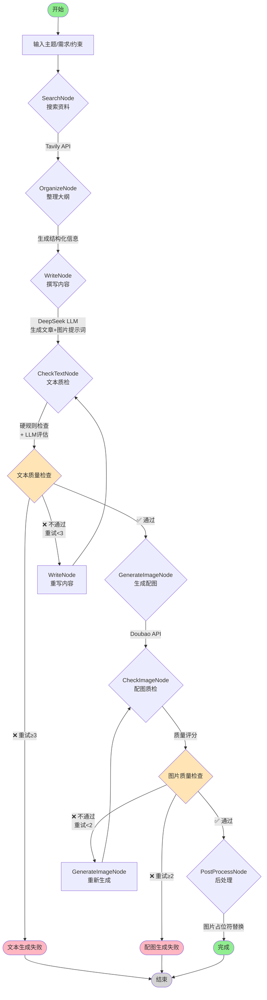
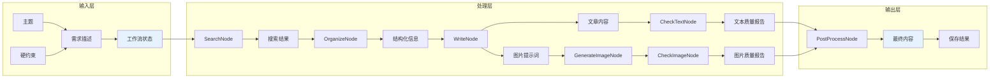
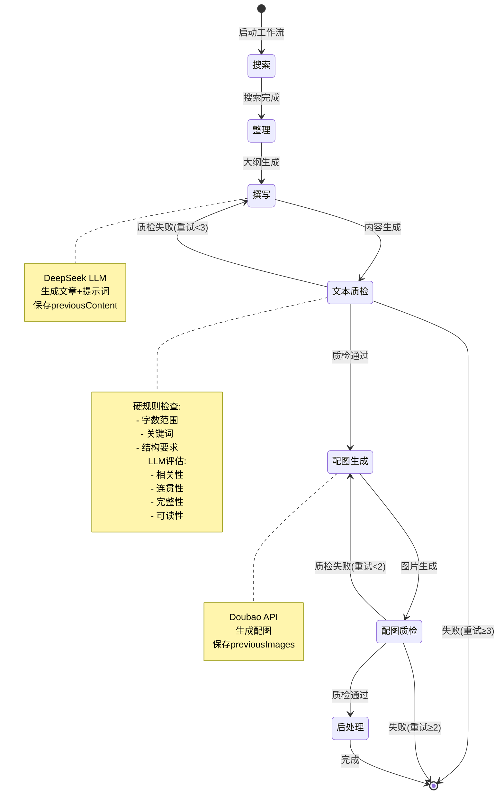
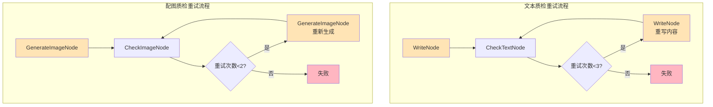
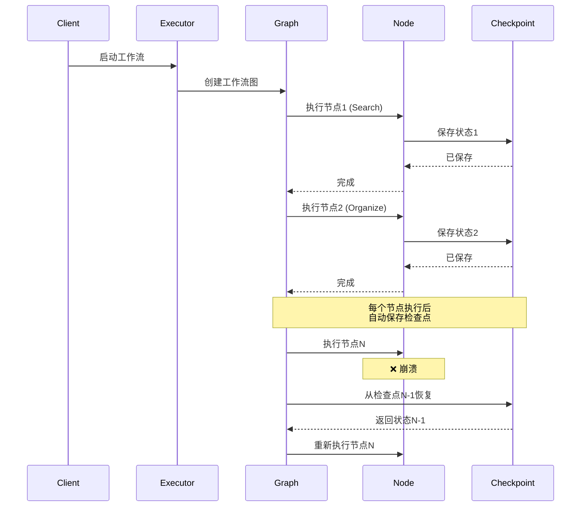
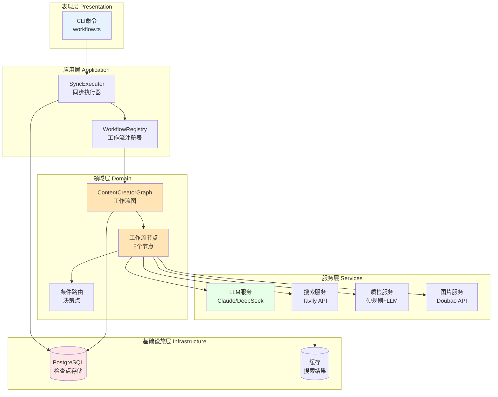
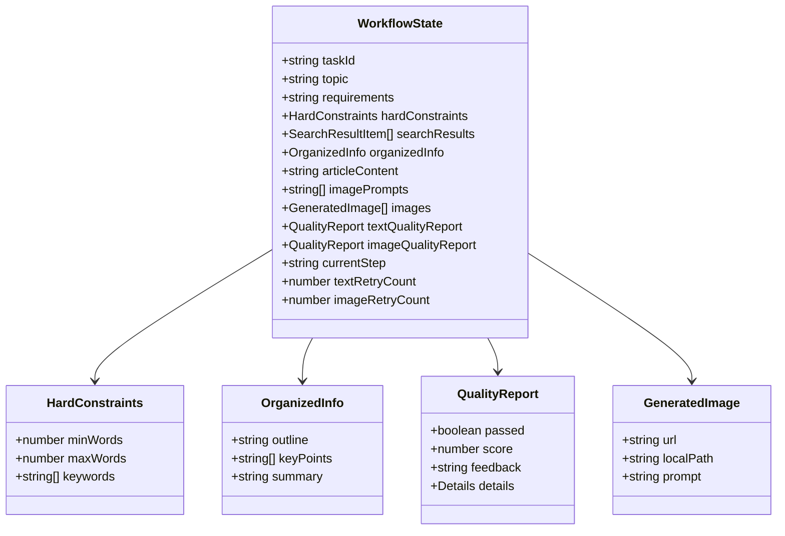

# 内容生成工作流流程图

## 完整工作流图



## 数据流图



## 状态机图



## 节点详情图

```mermaid
graph TB
    subgraph "SearchNode - 搜索节点"
        S1[生成搜索关键词]
        S2[调用Tavily API]
        S3[返回搜索结果]
        S1 --> S2 --> S3
    end

    subgraph "OrganizeNode - 整理节点"
        O1[分析搜索结果]
        O2[生成文章大纲]
        O3[提取关键点]
        O4[生成摘要]
        O1 --> O2
        O1 --> O3
        O1 --> O4
    end

    subgraph "WriteNode - 撰写节点"
        W1[接收结构化信息]
        W2[调用DeepSeek LLM]
        W3[生成文章内容]
        W4[生成图片提示词]
        W5[保存previousContent]
        W1 --> W2 --> W3
        W2 --> W4
        W3 --> W5
    end

    subgraph "CheckTextNode - 文本质检节点"
        T1[硬规则检查]
        T2[LLM质量评估]
        T3[生成质检报告]
        T4[计算综合评分]
        T1 --> T3
        T2 --> T3
        T3 --> T4
    end

    subgraph "GenerateImageNode - 配图生成节点"
        I1[接收图片提示词]
        I2[调用Doubao API]
        I3[生成配图]
        I4[保存previousImages]
        I1 --> I2 --> I3 --> I4
    end

    subgraph "CheckImageNode - 配图质检节点"
        C1[检查图片质量]
        C2[检查相关性]
        C3[生成质检报告]
        C4[计算评分(1-10)]
        C1 --> C3
        C2 --> C3
        C3 --> C4
    end

    S3 --> O1
    O2 --> W1
    O3 --> W1
    O4 --> W1
    W3 --> T1
    W3 --> T2
    W4 --> I1
    I3 --> C1
    I3 --> C2
```

## 重试机制图



## 检查点机制图



## 技术架构图



## 工作流状态数据结构



## 核心决策逻辑

```mermaid
graph TB
    start[开始决策] --> check{检查类型}

    check -->|文本质检| textCheck{硬规则通过?}
    textCheck -->|否| textHardFail[❌ 失败]
    textCheck -->|是| llmCheck{LLM评估通过?}

    llmCheck -->|否| textRetry{重试<3?}
    llmCheck -->|是| textPass[✅ 通过]

    textRetry -->|是| textRewrite[重写]
    textRetry -->|否| textHardFail

    textRewrite --> check

    check -->|图片质检| imageCheck{评分≥7?}
    imageCheck -->|否| imageRetry{重试<2?}
    imageCheck -->|是| imagePass[✅ 通过]

    imageRetry -->|是| imageRegen[重新生成]
    imageRetry -->|否| imageFail[❌ 失败]

    imageRegen --> check

    textPass --> next[下一步]
    imagePass --> next
    textHardFail --> end[结束]
    imageFail --> end

    style textPass fill:#90EE90
    style imagePass fill:#90EE90
    style textHardFail fill:#FFB6C1
    style imageFail fill:#FFB6C1
    style textRewrite fill:#FFE4B5
    style imageRegen fill:#FFE4B5
```

---

## 流程说明

### 主要节点

1. **SearchNode (搜索节点)**
   - 使用 Tavily API 搜索相关资料
   - 支持缓存机制
   - 生成结构化搜索结果

2. **OrganizeNode (整理节点)**
   - 分析搜索结果
   - 生成文章大纲、关键点和摘要
   - 为后续写作提供结构化信息

3. **WriteNode (撰写节点)**
   - 使用 DeepSeek LLM 生成文章内容
   - 同时生成配图提示词
   - 保存 previousContent 用于重写

4. **CheckTextNode (文本质检节点)**
   - 硬规则检查：字数、关键词、结构
   - LLM 质量评估：相关性、连贯性、完整性、可读性
   - 生成综合质检报告

5. **GenerateImageNode (配图生成节点)**
   - 使用 Doubao API 生成配图
   - 支持多张图片生成
   - 保存 previousImages 用于重新生成

6. **CheckImageNode (配图质检节点)**
   - 检查图片质量和相关性
   - 评分 1-10 分
   - 生成质检报告

### 决策点

1. **文本质检决策**
   - ✅ 通过 → 进入配图生成
   - ❌ 不通过且重试<3 → 重写内容
   - ❌ 不通过且重试≥3 → 失败

2. **配图质检决策**
   - ✅ 通过(评分≥7) → 进入后处理
   - ❌ 不通过且重试<2 → 重新生成
   - ❌ 不通过且重试≥2 → 失败

### 重试机制

- **文本质检重试**：最多 3 次
- **配图质检重试**：最多 2 次
- 每次重试都会基于前一次结果改进

### 检查点机制

- 每个节点执行后自动保存状态到 PostgreSQL
- 支持断点续传
- 崩溃后从最后一个检查点恢复
