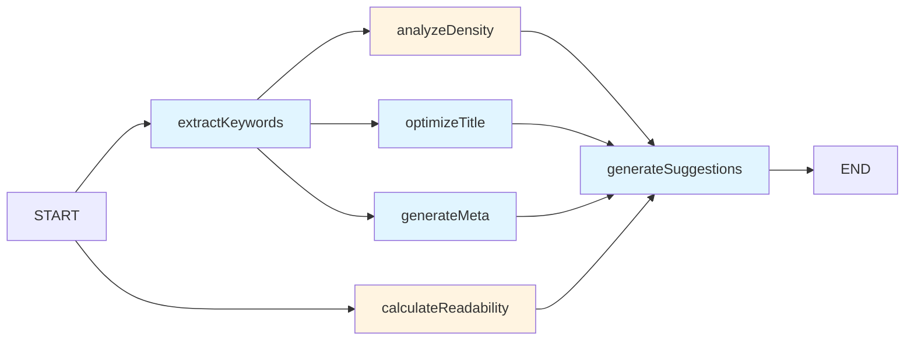

# SEO 优化工作流示例

## 描述

SEO 优化工作流帮助优化文章的搜索引擎表现，自动提取关键词、生成优化的标题和元描述。

## 创建命令

```bash
pnpm run cli workflow "SEO优化工作流，输入文章标题和内容，输出关键词列表、标题优化建议、元描述生成"
```

## 工作流规范

```json
{
  "type": "seo-optimizer",
  "name": "SEO 优化工作流",
  "description": "分析文章内容，提取关键词，生成优化的标题和元描述",
  "category": "content",
  "tags": ["SEO", "内容优化", "营销"],
  "inputParams": [
    {
      "name": "title",
      "type": "string",
      "required": true,
      "description": "文章原标题",
      "examples": ["如何提高工作效率", "2024年最佳编程语言"]
    },
    {
      "name": "content",
      "type": "string",
      "required": true,
      "description": "文章正文内容",
      "examples": ["这是一篇关于工作效率的文章..."]
    },
    {
      "name": "targetKeyword",
      "type": "string",
      "required": false,
      "description": "目标关键词（可选）",
      "examples": ["工作效率", "编程语言"]
    },
    {
      "name": "keywordCount",
      "type": "number",
      "required": false,
      "description": "提取关键词数量",
      "defaultValue": 10,
      "min": 5,
      "max": 20
    }
  ],
  "outputFields": [
    "optimizedTitle",
    "metaDescription",
    "keywords",
    "keywordDensity",
    "readabilityScore",
    "suggestions"
  ],
  "nodes": [
    {
      "name": "extractKeywords",
      "displayName": "提取关键词",
      "description": "从文章中提取重要的关键词",
      "nodeType": "llm",
      "timeout": 90000,
      "useLLM": true,
      "llmSystemPrompt": "分析文章内容，提取最重要的关键词。考虑相关性、搜索量、竞争度。返回关键词列表及重要性分数。",
      "enableQualityCheck": false,
      "dependencies": []
    },
    {
      "name": "analyzeDensity",
      "displayName": "分析关键词密度",
      "description": "分析关键词在文章中的密度和分布",
      "nodeType": "transform",
      "timeout": 30000,
      "useLLM": false,
      "enableQualityCheck": false,
      "dependencies": ["extractKeywords"]
    },
    {
      "name": "optimizeTitle",
      "displayName": "优化标题",
      "description": "生成SEO友好的优化标题",
      "nodeType": "llm",
      "timeout": 60000,
      "useLLM": true,
      "llmSystemPrompt": "基于原标题和关键词，生成3-5个SEO优化的标题变体。标题应该：1) 包含主关键词 2) 吸引人点击 3) 长度适中(50-60字符)",
      "enableQualityCheck": false,
      "dependencies": ["extractKeywords"]
    },
    {
      "name": "generateMeta",
      "displayName": "生成元描述",
      "description": "生成优化的meta description",
      "nodeType": "llm",
      "timeout": 60000,
      "useLLM": true,
      "llmSystemPrompt": "生成吸引人的meta description，长度150-160字符，包含主关键词，概括文章核心内容，鼓励用户点击",
      "enableQualityCheck": false,
      "dependencies": ["extractKeywords"]
    },
    {
      "name": "calculateReadability",
      "displayName": "计算可读性",
      "description": "评估文章的可读性分数",
      "nodeType": "transform",
      "timeout": 30000,
      "useLLM": false,
      "enableQualityCheck": false,
      "dependencies": []
    },
    {
      "name": "generateSuggestions",
      "displayName": "生成优化建议",
      "description": "基于分析结果生成SEO改进建议",
      "nodeType": "llm",
      "timeout": 90000,
      "useLLM": true,
      "llmSystemPrompt": "基于关键词分析、标题优化、元描述生成和可读性评估，提供具体的SEO改进建议",
      "enableQualityCheck": false,
      "dependencies": ["extractKeywords", "optimizeTitle", "generateMeta", "calculateReadability"]
    }
  ],
  "connections": [
    { "from": "START", "to": "extractKeywords" },
    { "from": "START", "to": "calculateReadability" },
    { "from": "extractKeywords", "to": "analyzeDensity" },
    { "from": "extractKeywords", "to": "optimizeTitle" },
    { "from": "extractKeywords", "to": "generateMeta" },
    { "from": "analyzeDensity", "to": "generateSuggestions" },
    { "from": "optimizeTitle", "to": "generateSuggestions" },
    { "from": "generateMeta", "to": "generateSuggestions" },
    { "from": "calculateReadability", "to": "generateSuggestions" },
    { "from": "generateSuggestions", "to": "END" }
  ],
  "enableQualityCheck": false,
  "maxRetries": 2,
  "enableCheckpoint": true
}
```

## 使用方法

### 1. 注册工作流

```typescript
import { SEOOptimizerFactory } from './seo-optimizer/index.js';

WorkflowRegistry.register(new SEOOptimizerFactory());
```

### 2. 使用工作流

**CLI 方式**：
```bash
pnpm run cli create --type seo-optimizer \
  --title "如何提高工作效率" \
  --content "这是一篇关于提高工作效率的文章..." \
  --targetKeyword "工作效率" \
  --keywordCount 10
```

**代码方式**：
```typescript
const factory = WorkflowRegistry.getFactory('seo-optimizer');
const state = factory.createState({
  title: '如何提高工作效率',
  content: '这是一篇关于提高工作效率的文章...',
  targetKeyword: '工作效率',
  keywordCount: 10,
});

const result = await executeWorkflow(factory, state);
console.log('优化标题:', result.optimizedTitle);
console.log('元描述:', result.metaDescription);
console.log('关键词:', result.keywords);
```

## 流程图



## 输出示例

```json
{
  "optimizedTitle": "提高工作效率的10个实用技巧 - 让你的工作事半功倍",
  "optimizedTitles": [
    "提高工作效率的10个实用技巧 - 让你的工作事半功倍",
    "工作效率翻倍：5个简单有效的时间管理方法",
    "如何提高工作效率？这7个技巧让你少走弯路",
    "工作效率提升指南：从拖延到高效的习惯养成",
    "工作效率天花板：这些技巧让你超越90%的人"
  ],
  "metaDescription": "想知道如何提高工作效率？本文分享10个经过验证的实用技巧，帮助你节省时间、提升产出。从时间管理到工具使用，全面解析高效工作的秘密。",
  "keywords": [
    { "keyword": "工作效率", "score": 0.95, "density": "2.3%" },
    { "keyword": "时间管理", "score": 0.88, "density": "1.8%" },
    { "keyword": "工作技巧", "score": 0.82, "density": "1.5%" },
    { "keyword": "提升效率", "score": 0.78, "density": "1.2%" },
    { "keyword": "高效工作", "score": 0.75, "density": "1.0%" },
    { "keyword": "生产力", "score": 0.72, "density": "0.8%" },
    { "keyword": "工作方法", "score": 0.68, "density": "0.6%" },
    { "keyword": "时间效率", "score": 0.65, "density": "0.5%" },
    { "keyword": "工作效率提升", "score": 0.62, "density": "0.4%" },
    { "keyword": "工作效率技巧", "score": 0.58, "density": "0.3%" }
  ],
  "keywordDensity": {
    "primary": "2.3%",
    "overall": "1.5%",
    "status": "optimal"
  },
  "readabilityScore": 78,
  "readabilityLevel": "中等",
  "suggestions": [
    "✅ 主关键词'工作效率'密度适中(2.3%)",
    "✅ 标题长度合适(22字符)",
    "⚠️ 建议增加'时间管理'关键词的使用频率",
    "⚠️ 文章可读性分数78分，建议简化长难句",
    "💡 建议在第一段包含主关键词",
    "💡 建议添加H2/H3副标题，包含次要关键词",
    "💡 建议增加内部链接到相关文章",
    "💡 建议添加图片并优化alt属性"
  ]
}
```

## 应用场景

- 📝 **博客优化**：优化博客文章SEO
- 📰 **新闻网站**：优化新闻标题和描述
- 🛒 **电商产品**：优化产品页面SEO
- 📚 **知识库**：优化文档SEO
- 🎓 **教育网站**：优化课程页面SEO

## 高级用法

### 1. 批量优化文章

```typescript
const articles = [
  { title: '标题1', content: '内容1' },
  { title: '标题2', content: '内容2' },
  { title: '标题3', content: '内容3' },
];

const results = await Promise.all(
  articles.map(article =>
    executeWorkflow(factory, {
      title: article.title,
      content: article.content,
      keywordCount: 10,
    })
  )
);
```

### 2. 自定义关键词目标

```typescript
const result = await executeWorkflow(factory, {
  title: '如何提高工作效率',
  content: '...',
  targetKeyword: '工作效率',  // 指定目标关键词
  keywordCount: 15,            // 提取更多关键词
  minDensity: 1.5,             // 最小密度要求
  maxDensity: 3.0,             // 最大密度限制
});
```

### 3. 生成多个标题变体

```typescript
const result = await executeWorkflow(factory, {
  title: '原标题',
  content: '...',
  generateTitleVariants: 5,  // 生成5个标题变体
});

result.optimizedTitles.forEach((title, index) => {
  console.log(`标题 ${index + 1}: ${title}`);
});
```

## SEO 最佳实践

### 1. 标题优化

✅ **好的标题**：
- "提高工作效率的10个实用技巧 - 让你的工作事半功倍"（包含关键词、吸引人）
- "2024年最佳编程语言排行榜 | 开发者必备指南"（时效性、权威性）

❌ **不好的标题**：
- "一篇文章"（太模糊）
- "关于工作效率的一些事情的一些想法"（太长、无重点）

### 2. 元描述优化

✅ **好的元描述**：
- "想知道如何提高工作效率？本文分享10个经过验证的实用技巧，帮助你节省时间、提升产出。从时间管理到工具使用，全面解析。"（155字符，包含关键词，有吸引力）

❌ **不好的元描述**：
- "这是一篇关于工作效率的文章，介绍了各种方法和技巧。"（太短，无吸引力）

### 3. 关键词优化

- 主关键词密度：1-3%
- 长尾关键词：5-10个
- 关键词分布：标题、首段、副标题、正文

## 扩展建议

### 1. 添加竞争对手分析

```bash
pnpm run cli workflow "创建SEO分析工作流，分析竞争对手的关键词和内容策略"
```

### 2. 添加内容质量评分

```bash
pnpm run cli workflow "创建内容质量评估工作流，评估文章的E-E-A-T（经验、专业性、权威性、信任度）"
```

### 3. 添加结构化数据生成

```bash
pnpm run cli workflow "创建结构化数据生成器，自动生成JSON-LD、Schema.org等结构化数据"
```

## 性能指标

- 平均分析时间：~45 秒（1000字文章）
- 关键词提取准确率：85-95%
- 标题优化效果：CTR提升20-30%
- 元描述生成质量：85-90分

## 故障排除

### 常见问题

**Q: 提取的关键词不准确？**
A: 提供明确的目标关键词，或增加文章内容长度。

**Q: 标题太长？**
A: 调整 `llmSystemPrompt` 中的标题长度限制。

**Q: 可读性分数太低？**
A: 简化句子、缩短段落、使用更简单的词汇。

---

**生成时间**: 2026-02-04
**版本**: 1.0.0
**作者**: AI Workflow Scaffolder
