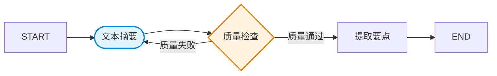

# 可视化预览系统

工作流脚手架的可视化预览系统，用于展示工作流设计的各种视图。

## 功能特性

### 1. Mermaid 流程图生成
- 自动生成 Mermaid 格式的流程图
- 支持不同节点类型的形状和样式
- 显示条件分支和连接关系
- 支持多种图表方向（LR、TB、RL、BT）

### 2. 节点关系表生成
- 生成 ASCII 表格显示节点信息
- 支持自定义列配置
- 显示节点名称、类型、超时、依赖、特性等
- 自动对齐和格式化

### 3. 数据流图生成
- 显示输入参数详情
- 显示节点处理流程
- 显示输出结果
- 支持不同边框样式

### 4. 预览系统集成
- 集成所有可视化组件
- 使用 chalk 美化终端输出
- 支持颜色显示配置
- 支持选择性显示各个部分

## 使用方法

### 基本使用

```typescript
import { VisualizationPreviewSystem } from './VisualizationPreviewSystem.js';
import type { WorkflowRequirement } from '../schemas/WorkflowRequirementSchema.js';

// 创建预览系统
const visualizer = new VisualizationPreviewSystem({
  useColors: true,  // 使用颜色
});

// 显示完整预览
await visualizer.displayPreview(workflowRequirement);
```

### 单独使用各组件

#### Mermaid 流程图生成器

```typescript
import { MermaidDiagramGenerator } from './MermaidDiagramGenerator.js';

const generator = new MermaidDiagramGenerator({
  direction: 'LR',        // 图表方向
  showNodeNames: true,    // 显示节点名称
  showConditions: true,   // 显示条件
  useSubgraphs: false,    // 使用子图
});

// 生成 Mermaid 代码
const mermaidCode = generator.generateMermaidDiagram(requirement);

// 生成简化图
const simplified = generator.generateSimplifiedDiagram(requirement);
```

#### 节点关系表生成器

```typescript
import { NodeTableGenerator } from './NodeTableGenerator.js';

const generator = new NodeTableGenerator({
  showBorder: true,       // 显示边框
  showHeader: true,       // 显示表头
  showRowNumbers: false,  // 显示行号
});

// 生成节点表
const table = generator.generateNodeTable(nodes, connections);

// 生成简化表
const simplified = generator.generateSimplifiedTable(nodes, connections);
```

#### 数据流图生成器

```typescript
import { DataFlowDiagramGenerator } from './DataFlowDiagramGenerator.js';

const generator = new DataFlowDiagramGenerator({
  showTypes: true,        // 显示类型
  showExamples: false,    // 显示示例
  showRequired: true,     // 显示必需标记
  borderStyle: 'single',  // 边框样式
});

// 生成数据流图
const diagram = generator.generateDataFlowDiagram(
  inputParams,
  nodes,
  outputFields
);

// 生成简化图
const simplified = generator.generateSimplifiedDiagram(
  inputParams,
  nodes,
  outputFields
);
```

### 配置选项

#### PreviewSystemConfig

```typescript
interface PreviewSystemConfig {
  /** 是否显示 Mermaid 图 */
  showMermaid?: boolean;

  /** 是否显示节点表 */
  showNodeTable?: boolean;

  /** 是否显示数据流图 */
  showDataFlow?: boolean;

  /** 是否使用颜色 */
  useColors?: boolean;

  /** Mermaid 生成器配置 */
  mermaidConfig?: MermaidGeneratorConfig;

  /** 节点表配置 */
  nodeTableConfig?: NodeTableConfig;

  /** 数据流图配置 */
  dataFlowConfig?: DataFlowConfig;
}
```

#### MermaidGeneratorConfig

```typescript
interface MermaidGeneratorConfig {
  /** 图表方向 */
  direction?: 'TB' | 'TD' | 'BT' | 'RL' | 'LR';

  /** 是否显示节点名称 */
  showNodeNames?: boolean;

  /** 是否显示条件标签 */
  showConditions?: boolean;

  /** 是否使用子图分组 */
  useSubgraphs?: boolean;
}
```

#### NodeTableConfig

```typescript
interface NodeTableConfig {
  /** 自定义列配置 */
  columns?: TableColumn[];

  /** 是否显示边框 */
  showBorder?: boolean;

  /** 是否显示表头 */
  showHeader?: boolean;

  /** 是否显示行号 */
  showRowNumbers?: boolean;
}
```

#### DataFlowConfig

```typescript
interface DataFlowConfig {
  /** 是否显示类型信息 */
  showTypes?: boolean;

  /** 是否显示示例值 */
  showExamples?: boolean;

  /** 是否显示必需标记 */
  showRequired?: boolean;

  /** 框线样式 */
  borderStyle?: 'single' | 'double' | 'dashed';
}
```

## 示例

### 完整预览示例

```typescript
import { VisualizationPreviewSystem } from './visualization/index.js';

// 创建工作流需求
const requirement: WorkflowRequirement = {
  type: 'text-summarizer',
  name: '文本摘要工作流',
  description: '使用 LLM 进行文本摘要',
  category: 'content',
  tags: ['摘要', 'NLP'],
  inputParams: [
    {
      name: 'sourceText',
      type: 'string',
      required: true,
      description: '待摘要的文本',
    },
  ],
  outputFields: ['summarizedText'],
  nodes: [
    {
      name: 'summarize',
      displayName: '文本摘要',
      description: '使用 LLM 生成摘要',
      nodeType: 'llm',
      timeout: 120000,
      useLLM: true,
      llmSystemPrompt: '请对文本进行摘要...',
      enableQualityCheck: true,
      qualityCheckPrompt: '检查摘要质量',
      dependencies: [],
    },
  ],
  connections: [
    { from: 'START', to: 'summarize' },
    { from: 'summarize', to: 'END' },
  ],
  enableQualityCheck: true,
  maxRetries: 3,
  enableCheckpoint: true,
};

// 显示预览
const visualizer = new VisualizationPreviewSystem();
await visualizer.displayPreview(requirement);
```

### 仅显示特定部分

```typescript
// 只显示 Mermaid 图和节点表
const visualizer = new VisualizationPreviewSystem({
  showMermaid: true,
  showNodeTable: true,
  showDataFlow: false,  // 隐藏数据流图
});

await visualizer.displayPreview(requirement);
```

### 导出 Mermaid 代码

```typescript
const visualizer = new VisualizationPreviewSystem();

// 导出 Mermaid 代码
const mermaidCode = visualizer.exportMermaidCode(requirement);

// 保存到文件
import { writeFileSync } from 'fs';
writeFileSync('workflow-diagram.mmd', mermaidCode);
```

### 生成简化预览

```typescript
const visualizer = new VisualizationPreviewSystem();

// 生成简化的预览字符串
const simplified = visualizer.generateSimplifiedPreview(requirement);

console.log(simplified);
```

## 输出示例

### Mermaid 流程图



### 节点关系表

```
┌─────────────┬──────────┬────────────┬────────────┬──────────┐
│ 节点名称    │ 类型     │ 超时时间   │ 依赖节点   │ 特性     │
├─────────────┼──────────┼────────────┼────────────┼──────────┤
│ 文本摘要    │ LLM      │ 120s       │ -          │ LLM, 质检│
│ 质量检查    │ 质检     │ 60s        │ summarize  │ LLM      │
│ 提取要点    │ 转换     │ 30s        │ checkQuality│ -        │
└─────────────┴──────────┴────────────┴────────────┴──────────┘
```

### 数据流图

```
────────
│ 输入参数 │
────────
  • sourceText (string)* : 待摘要的文本
  • maxLength (number)   : 摘要最大长度

────────
│ 节点处理 │
────────
  文本摘要 (summarize)
    类型: LLM 调用
    特性: 使用 LLM, 包含质检

  质量检查 (checkQuality)
    类型: 质量检查
    特性: 使用 LLM
    依赖: summarize

────────
│ 输出结果 │
────────
  • summarizedText
  • originalLength
  • summaryLength
```

## 测试

运行测试：

```bash
# 运行所有可视化系统测试
pnpm test src/presentation/cli/scaffolding/visualization/__tests__/VisualizationPreviewSystem.test.ts

# 运行演示
pnpm tsx src/presentation/cli/scaffolding/visualization/demo.ts
```

## 高级用法

### 自定义节点表列

```typescript
import { NodeTableGenerator, type TableColumn } from './NodeTableGenerator.js';

const customColumns: TableColumn[] = [
  {
    header: '节点',
    width: 15,
    align: 'left',
    getValue: (node) => node.displayName,
  },
  {
    header: '描述',
    width: 30,
    align: 'left',
    getValue: (node) => node.description,
  },
  {
    header: '是否用LLM',
    width: 10,
    align: 'center',
    getValue: (node) => node.useLLM ? '是' : '否',
  },
];

const generator = new NodeTableGenerator({ columns: customColumns });
const table = generator.generateNodeTable(nodes, connections);
```

### 动态更新配置

```typescript
const visualizer = new VisualizationPreviewSystem();

// 更新配置
visualizer.updateConfig({
  showMermaid: false,
  useColors: false,
});

// 使用新配置显示
await visualizer.displayPreview(requirement);
```

### 访问底层生成器

```typescript
const visualizer = new VisualizationPreviewSystem();

// 获取各个生成器
const mermaidGen = visualizer.getMermaidGenerator();
const tableGen = visualizer.getNodeTableGenerator();
const dataFlowGen = visualizer.getDataFlowGenerator();

// 单独使用
const mermaidCode = mermaidGen.generateMermaidDiagram(requirement);
const table = tableGen.generateNodeTable(nodes, connections);
const diagram = dataFlowGen.generateDataFlowDiagram(params, nodes, outputs);
```

## 注意事项

1. **颜色显示**：在某些终端中，颜色可能不显示。可以设置 `useColors: false` 禁用颜色
2. **表格宽度**：ASCII 表格在某些终端中可能显示不整齐，建议调整终端宽度
3. **Mermaid 语法**：生成的 Mermaid 代码符合标准语法，可以在支持 Mermaid 的 Markdown 查看器中渲染
4. **性能**：对于包含大量节点的工作流，生成预览可能需要一些时间

## 未来扩展

- [ ] 支持导出为图片（PNG、SVG）
- [ ] 支持交互式 HTML 预览
- [ ] 支持更多图表样式和主题
- [ ] 支持自定义节点形状和颜色
- [ ] 支持动画效果展示工作流执行流程

## 相关文档

- [工作流需求 Schema](../schemas/WorkflowRequirementSchema.ts)
- [AI 理解引擎](../ai/AINeuralUnderstandingEngine.ts)
- [设计文档](../../../../docs/design/workflow-scaffolding-design.md)
