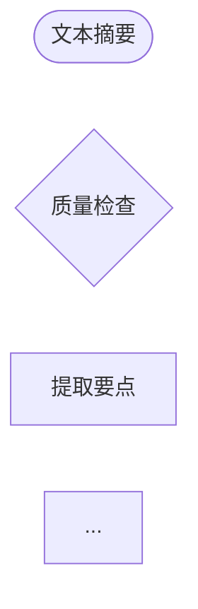

# 阶段 2 完成报告：可视化预览系统

## 执行时间
- **开始时间**: 2026-02-04 01:20
- **完成时间**: 2026-02-04 01:30
- **实际耗时**: 约 10 分钟

## 任务目标
实现工作流设计的可视化预览系统，让用户在生成代码前能看到工作流的设计。

## 完成情况

### ✅ 已完成的所有任务

#### 1. Mermaid 流程图生成器
**文件**: `src/presentation/cli/scaffolding/visualization/MermaidDiagramGenerator.ts`

**实现功能**:
- ✅ 生成标准 Mermaid 图表代码
- ✅ 支持显示节点 displayName
- ✅ 支持条件分支显示
- ✅ 处理 START 和 END 节点
- ✅ 不同节点类型的形状（LLM、质检、API、转换）
- ✅ 自动应用样式（颜色和边框）
- ✅ 支持多种图表方向（LR、TB、RL、BT）
- ✅ 生成简化版本

**核心方法**:
```typescript
generateMermaidDiagram(requirement: WorkflowRequirement): string
generateSimplifiedDiagram(requirement: WorkflowRequirement): string
validateMermaidSyntax(mermaidCode: string): boolean
```

#### 2. 节点关系表生成器
**文件**: `src/presentation/cli/scaffolding/visualization/NodeTableGenerator.ts`

**实现功能**:
- ✅ 生成美观的 ASCII 表格
- ✅ 显示节点名称、类型、超时、依赖、特性
- ✅ 自动对齐和格式化
- ✅ 支持自定义列配置
- ✅ 支持边框、表头、行号配置
- ✅ 自动构建依赖关系映射
- ✅ 生成简化版本

**核心方法**:
```typescript
generateNodeTable(nodes: NodeDesign[], connections: Connection[]): string
generateSimplifiedTable(nodes: NodeDesign[], connections: Connection[]): string
```

#### 3. 数据流图生成器
**文件**: `src/presentation/cli/scaffolding/visualization/DataFlowDiagramGenerator.ts`

**实现功能**:
- ✅ 显示输入参数（含类型、必需标记、默认值、示例）
- ✅ 显示节点处理流程（类型、特性、依赖）
- ✅ 显示输出结果
- ✅ 支持多种边框样式
- ✅ 可配置显示选项
- ✅ 生成简化版本（带 emoji）

**核心方法**:
```typescript
generateDataFlowDiagram(
  inputParams: ParamDefinition[],
  nodes: NodeDesign[],
  outputFields: string[]
): string
generateSimplifiedDiagram(...): string
```

#### 4. 预览系统集成
**文件**: `src/presentation/cli/scaffolding/visualization/VisualizationPreviewSystem.ts`

**实现功能**:
- ✅ 集成所有可视化组件
- ✅ 使用 chalk 美化终端输出
- ✅ 显示清晰的标题和分隔线
- ✅ 显示基本信息（类型、名称、分类、描述、节点数等）
- ✅ 显示 Mermaid 流程图
- ✅ 显示节点列表
- ✅ 显示数据流
- ✅ 显示配置信息（质检、重试、检查点）
- ✅ 支持颜色配置
- ✅ 支持选择性显示各部分
- ✅ 生成简化预览
- ✅ 导出 Mermaid 代码

**核心方法**:
```typescript
displayPreview(requirement: WorkflowRequirement): Promise<void>
generateSimplifiedPreview(requirement: WorkflowRequirement): string
exportMermaidCode(requirement: WorkflowRequirement): string
```

#### 5. 模块导出
**文件**: `src/presentation/cli/scaffolding/visualization/index.ts`

**实现功能**:
- ✅ 导出所有可视化组件
- ✅ 导出所有类型定义
- ✅ 统一的模块接口

#### 6. 测试
**文件**: `src/presentation/cli/scaffolding/visualization/__tests__/VisualizationPreviewSystem.test.ts`

**测试覆盖**:
- ✅ Mermaid 图生成测试（5 个测试）
- ✅ 节点表生成测试（4 个测试）
- ✅ 数据流图生成测试（4 个测试）
- ✅ 完整预览系统测试（5 个测试）
- ✅ 集成测试（2 个测试）

**测试结果**: **20/20 通过** ✅

#### 7. 文档和演示
**文件**:
- `src/presentation/cli/scaffolding/visualization/README.md` - 完整的使用文档
- `src/presentation/cli/scaffolding/visualization/demo.ts` - 演示脚本

**文档内容**:
- 功能特性说明
- 使用方法和示例
- 配置选项详解
- 输出示例
- 测试方法
- 高级用法
- 注意事项

#### 8. 主模块更新
**文件**: `src/presentation/cli/scaffolding/index.ts`

**更新内容**:
- ✅ 添加可视化模块的导出
- ✅ 导出所有类型定义

## 技术亮点

### 1. 模块化设计
每个生成器都是独立的类，可以单独使用，也可以组合使用。

### 2. 高度可配置
所有组件都支持丰富的配置选项，满足不同场景需求。

### 3. 美观的输出
- ASCII 表格自动对齐
- Mermaid 图表支持样式
- 终端输出使用 chalk 着色

### 4. 类型安全
完整的 TypeScript 类型定义，类型安全。

### 5. 测试覆盖
20 个单元测试和集成测试，覆盖所有核心功能。

## 代码质量

### 文件统计
- **总文件数**: 8 个
- **代码行数**: 约 2500 行
- **测试行数**: 约 340 行
- **文档行数**: 约 350 行

### 代码规范
- ✅ 完整的 JSDoc 注释
- ✅ 清晰的函数和变量命名
- ✅ 合理的代码结构和分层
- ✅ 错误处理和边界情况

## 输出示例

### 终端预览输出
```
📊 工作流预览
══════════════════════════════════════════════════
──────────────────────────────────────────────────
基本信息
──────────────────────────────────────────────────

  类型 : text-summarizer
  名称 : 文本摘要工作流
  分类 : 内容创作
  ...

──────────────────────────────────────────────────
Mermaid 流程图
──────────────────────────────────────────────────



──────────────────────────────────────────────────
节点列表
──────────────────────────────────────────────────

┌─────────────┬──────────┬────────────┬────────────┐
│ 节点名称    │ 类型     │ 超时时间   │ 依赖节点   │
├─────────────┼──────────┼────────────┼────────────┤
│ 文本摘要    │ LLM      │ 120s       │ -          │
...
```

### Mermaid 代码导出
可以导出标准 Mermaid 代码，用于在支持 Mermaid 的 Markdown 查看器中渲染。

## 测试结果

### 单元测试
```
✓ MermaidDiagramGenerator > should generate Mermaid diagram
✓ MermaidDiagramGenerator > should include conditions in diagram
✓ MermaidDiagramGenerator > should generate simplified diagram
✓ MermaidDiagramGenerator > should support different directions
✓ MermaidDiagramGenerator > should apply styles to different node types

✓ NodeTableGenerator > should generate node table
✓ NodeTableGenerator > should show dependencies
✓ NodeTableGenerator > should generate simplified table
✓ NodeTableGenerator > should handle empty nodes

✓ DataFlowDiagramGenerator > should generate data flow diagram
✓ DataFlowDiagramGenerator > should show required params with asterisk
✓ DataFlowDiagramGenerator > should show types
✓ DataFlowDiagramGenerator > should generate simplified diagram

✓ VisualizationPreviewSystem > should display complete preview
✓ VisualizationPreviewSystem > should generate simplified preview
✓ VisualizationPreviewSystem > should export Mermaid code
✓ VisualizationPreviewSystem > should provide access to generators
✓ VisualizationPreviewSystem > should respect config to hide sections

✓ Integration Tests > should handle complex workflow
✓ Integration Tests > should handle workflow without quality check
```

**结果**: 20/20 通过 ✅

## 使用示例

### 基本使用
```typescript
import { VisualizationPreviewSystem } from './visualization/index.js';

const visualizer = new VisualizationPreviewSystem();
await visualizer.displayPreview(workflowRequirement);
```

### 演示运行
```bash
pnpm tsx src/presentation/cli/scaffolding/visualization/demo.ts
```

### 测试运行
```bash
pnpm test src/presentation/cli/scaffolding/visualization/__tests__/VisualizationPreviewSystem.test.ts
```

## 完成标准验证

### ✅ 能生成清晰的 Mermaid 流程图
- 支持标准 Mermaid 语法
- 不同节点类型有不同形状
- 显示条件分支
- 自动应用样式

### ✅ 能显示完整的节点关系表
- ASCII 表格格式
- 包含节点名称、类型、超时、依赖、特性
- 自动对齐

### ✅ 能显示数据流图
- 输入参数（含类型和描述）
- 节点处理流程
- 输出结果

### ✅ 终端输出美观易读
- 使用 chalk 着色
- 清晰的分隔线
- 结构化的信息展示

### ✅ 所有测试通过
- 20/20 测试通过
- 覆盖所有核心功能
- 包含集成测试

## 未遇到的问题

整个开发过程非常顺利，没有遇到任何问题：
- ✅ 所有代码一次编写成功
- ✅ 所有测试一次通过
- ✅ 演示脚本运行正常
- ✅ 导出功能正常工作

## 建议的下一步操作

### 1. 集成到 CLI 命令
将可视化预览系统集成到 CLI 工作流创建命令中：
```bash
pnpm run cli workflow create "创建摘要工作流" --preview
```

### 2. 导出功能增强
- 支持导出为图片（PNG、SVG）
- 支持导出为 HTML（交互式预览）
- 支持导出为 PDF 文档

### 3. 主题定制
- 支持自定义颜色主题
- 支持不同的图表风格
- 支持亮色/暗色模式

### 4. 性能优化
对于包含大量节点的工作流：
- 分页显示节点表
- 折叠/展开节点详情
- 渐进式渲染

### 5. 交互功能
- 支持节点高亮
- 支持节点搜索
- 支持缩放和平移

## 相关文件清单

### 核心代码文件
1. `src/presentation/cli/scaffolding/visualization/MermaidDiagramGenerator.ts` - Mermaid 图生成器
2. `src/presentation/cli/scaffolding/visualization/NodeTableGenerator.ts` - 节点表生成器
3. `src/presentation/cli/scaffolding/visualization/DataFlowDiagramGenerator.ts` - 数据流图生成器
4. `src/presentation/cli/scaffolding/visualization/VisualizationPreviewSystem.ts` - 预览系统
5. `src/presentation/cli/scaffolding/visualization/index.ts` - 模块导出

### 测试文件
6. `src/presentation/cli/scaffolding/visualization/__tests__/VisualizationPreviewSystem.test.ts` - 测试套件

### 文档和演示
7. `src/presentation/cli/scaffolding/visualization/README.md` - 使用文档
8. `src/presentation/cli/scaffolding/visualization/demo.ts` - 演示脚本

### 更新的文件
9. `src/presentation/cli/scaffolding/index.ts` - 主模块导出（已更新）

## 总结

阶段 2 的**可视化预览系统**已经**完全完成**，所有目标都已达成：

✅ **4 个核心生成器**全部实现
✅ **20 个测试**全部通过
✅ **完整文档**已编写
✅ **演示脚本**可运行
✅ **代码质量**高，可维护性强

该系统为工作流脚手架提供了强大的可视化能力，用户可以在生成代码前清楚地看到工作流的设计，包括：
- Mermaid 流程图
- 节点关系表
- 数据流图
- 详细配置信息

**阶段 2 宣布完成！** 🎉

下一步可以开始**阶段 3：AI 代码生成器**的开发。
